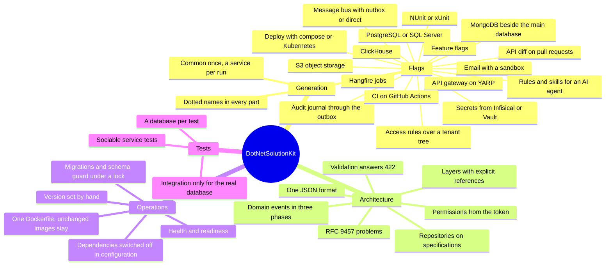

# Documentation

**DotNetSolutionKit (dotskit)** is a configurable `dotnet new` template and lifecycle toolkit for standardized .NET solutions.

It provides ready-to-use architectural building blocks, modules, and integrations with infrastructure services that can be combined through flags to create different solution variants tailored to a team's needs and infrastructure. It generates microservice solutions based on DDD and Clean Architecture, with CI, deployment, and testing, adds services, connects modules to them, and upgrades solutions to new template versions while preserving the team's code. The generated solution remains an ordinary .NET project owned by the team, allowing them to focus on the architecture of the solution they are building and its business logic.

What the template gives a solution, at a glance:

## Getting started

- [What the template gives](getting-started/what-it-gives.md): what a solution gets, the principles, the cost and the risks
- [Generating a solution](getting-started/generating-a-solution.md): install, parameters, dotted names,
  running locally
- [dotskit](getting-started/dotskit.md): the tool that makes a solution, adds services and flags to it,
  describes a solution made without it and upgrades a solution, keeping the team's changes
- [Versions of the template](getting-started/upgrading.md): v1 and v2, what changed, how to update
- [Working with AI agents](getting-started/working-with-ai-agents.md): the rules and skills a solution gets

## Architecture

- [Projects and layers](architecture/projects-and-layers.md)
- [Web layer](architecture/web-layer.md): the host and the pipeline every service shares
- [Errors](architecture/errors.md): RFC 9457 problems
- [Validation and pagination](architecture/validation-and-pagination.md)
- [Authentication and permissions](architecture/authentication-and-permissions.md)
- [Persistence](architecture/persistence.md): schemas, migrations, repositories, search
- [Settings](architecture/settings.md): their sources, and what changes while a service runs
- [Domain events](architecture/domain-events.md)
- [Testing](architecture/testing.md)

## Features

- [Background jobs](features/background-jobs.md): Hangfire, `--Hangfire`
- [Message bus](features/messaging.md): MassTransit, `--Messaging`
- [Secrets from Infisical or Vault](features/secrets.md): `-I`, `--Vault`
- [Feature flags](features/feature-flags.md): `--FeatureFlags`
- [API diff](features/api-diff.md): `--DiffApi`
- [CI on GitHub Actions](features/ci.md): `--GitHubCiCd`
- [Access rules over a tenant tree](features/hierarchy-rules.md): `--HierarchyRules`
- [Object storage](features/object-storage.md): S3-compatible, `--Storage`
- [ClickHouse](features/clickhouse.md): `--ClickHouse`
- [MongoDB](features/mongodb.md): `--MongoDB`
- [Notifications](features/notifications.md): email, `--Notify`
- [Audit journal](features/audit.md): `--Audit`, with `--Messaging outbox`
- [API gateway](features/api-gateway.md): YARP, `--ApiGateway`

## Operations

- [Docker](operations/docker.md): one Dockerfile, only changed services rebuilt
- [Deployment](operations/deployment.md): docker compose or Kubernetes, `--Deploy`
- [Health](operations/health.md): `/health` and `/ready`
- [Startup checks](operations/startup-checks.md)
- [Switching dependencies off](operations/switching-dependencies-off.md): run without the database, the
  jobs, the bus or the secret store, and turn them on later

## Decisions

Where the template departs from a common practice, and why.

- [ADR-001: Domain events run in three phases tied to the transaction](adr/001-three-phase-domain-events.md)
- [ADR-002: Repositories take queries as specifications](adr/002-repositories-on-specifications.md)
- [ADR-003: The API document is read from the built application](adr/003-api-schema-generation.md)
- [ADR-004: The product version is set by hand](adr/004-product-version-by-hand.md)
- [ADR-005: How a service is tested](adr/005-testing-a-service.md)
- [ADR-006: JSON metadata keys](adr/006-json-metadata-key-convention.md)

## [Roadmap](roadmap.md)

What is planned, and where the template ties a team to one technology.
