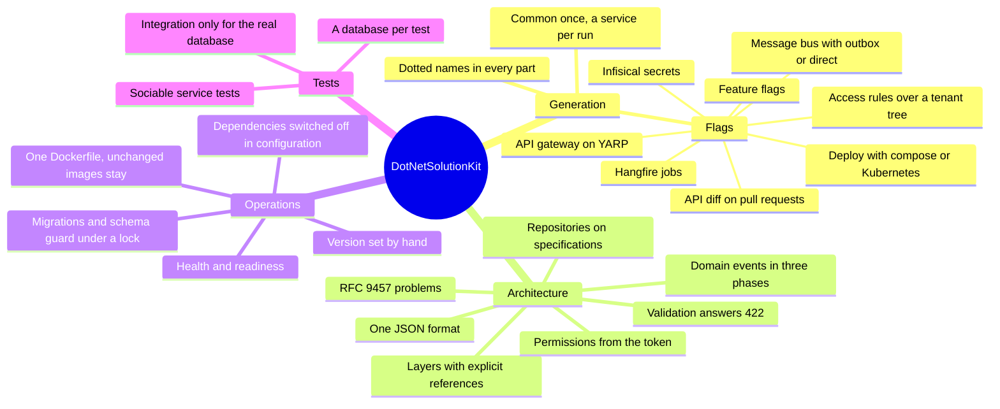

# Документация

Что шаблон даёт решению, на одной схеме:

## Начало работы

- [Что даёт шаблон](getting-started/what-it-gives.md): что получает решение, принципы, цена и риски
- [Генерация решения](getting-started/generating-a-solution.md): установка, параметры, имена с точками,
  локальный запуск
- [Версии шаблона](getting-started/upgrading.md): v1 и v2, что изменилось, как обновиться
- [Работа с ИИ-агентами](getting-started/working-with-ai-agents.md): правила и скиллы, которые получает решение

## Архитектура

- [Проекты и слои](architecture/projects-and-layers.md)
- [Веб-слой](architecture/web-layer.md): хост и конвейер, общие для всех сервисов
- [Ошибки](architecture/errors.md): problem details по RFC 9457
- [Валидация и пагинация](architecture/validation-and-pagination.md)
- [Аутентификация и права](architecture/authentication-and-permissions.md)
- [Хранение данных](architecture/persistence.md): схемы, миграции, репозитории, поиск
- [Настройки](architecture/settings.md): откуда берутся и что меняется, пока сервис работает
- [Доменные события](architecture/domain-events.md)
- [Тестирование](architecture/testing.md)

## Возможности

- [Фоновые задачи](features/background-jobs.md): Hangfire, `--Hangfire`
- [Шина сообщений](features/messaging.md): MassTransit, `--Messaging`
- [Секреты из Infisical](features/secrets.md): `-I`
- [Фича-флаги](features/feature-flags.md): `--FeatureFlags`
- [Сравнение API](features/api-diff.md): `--DiffApi`
- [CI на GitHub Actions](features/ci.md): `--GitHubCiCd`
- [Правила доступа по дереву тенантов](features/hierarchy-rules.md): `--HierarchyRules`
- [Объектное хранилище](features/object-storage.md): совместимое с S3, `--Storage`
- [ClickHouse](features/clickhouse.md): `--ClickHouse`
- [Журнал аудита](features/audit.md): `--Audit`, вместе с `--Messaging outbox`
- [API-шлюз](features/api-gateway.md): YARP, `--ApiGateway`

## Эксплуатация

- [Docker](operations/docker.md): один Dockerfile, пересобираются только изменённые сервисы
- [Развёртывание](operations/deployment.md): docker compose или Kubernetes, `--Deploy`
- [Здоровье](operations/health.md): `/health` и `/ready`
- [Проверки при старте](operations/startup-checks.md)
- [Отключение зависимостей](operations/switching-dependencies-off.md): запуск без базы данных, фоновых
  задач, шины или хранилища секретов с последующим включением

## Решения

Где шаблон расходится с распространённой практикой и почему.

- [ADR-001: Доменные события выполняются в три фазы, привязанные к транзакции](adr/001-three-phase-domain-events.md)
- [ADR-002: Репозитории принимают запросы как спецификации](adr/002-repositories-on-specifications.md)
- [ADR-003: Документ API читается из собранного приложения](adr/003-api-schema-generation.md)
- [ADR-004: Версия продукта задаётся вручную](adr/004-product-version-by-hand.md)
- [ADR-005: Как тестируется сервис](adr/005-testing-a-service.md)

## [Дорожная карта](roadmap.md)

Что запланировано и где шаблон привязывает команду к одной технологии.
