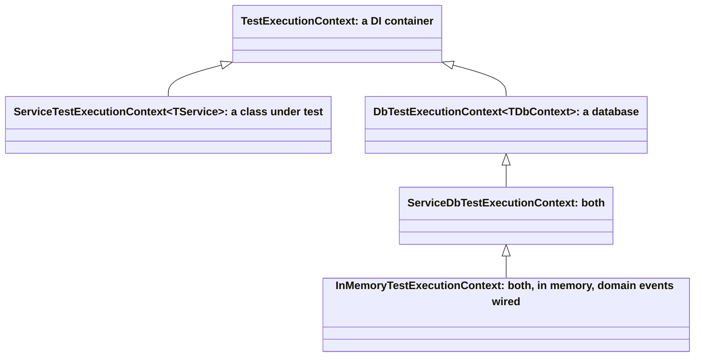

# ADR-005: How a service is tested

**Status:** Accepted, 2026-10-03

## Context

Two styles are common for testing a .NET service.

- **Solitary unit tests.** The class under test gets mocks for every dependency, repositories included.
  They are fast, but a mocked repository answers what the test told it to, so the test checks the
  arrangement rather than the code. A query that filters wrongly, a missing `Include`, an entity never
  added to the context: none of it can fail such a test.
- **Integration tests through the host** (`WebApplicationFactory` against a real database). They check
  the code against a real database, but each needs a database, they are slow, and they are hard to run in parallel. A team
  ends up writing a unit test and an integration test for the same scenario, or skipping one.

Most of what a service does sits between the two: a use case loads aggregates through repositories,
changes them, raises domain events and saves. Testing that needs the real repositories and the real
`DbContext`, but not HTTP and not PostgreSQL.

## Decision

Each kind of code gets the cheapest test that can fail when the code is wrong.

| Kind | Tests | Built with | Replaced |
|---|---|---|---|
| Unit | Entities, value objects, policies, validators, pure helpers | `new`, no container | nothing |
| Service (sociable) | Application services and use cases | `InMemoryTestExecutionContext<TService, TDbContext>` | only what leaves the service: e-mail, tokens, other services, time |
| Consumer | Message consumers | the same context, with the consumer as the class under test and a built `ConsumeContext` | as for a service |
| Event handler | Domain event handlers | the handler with its ports mocked | the ports the handler calls |
| Job | Background jobs | the job with its ports mocked | the ports the job orchestrates; the test verifies the calls |
| Pipeline | What a request goes through: validation, errors, permissions, pagination | a test server (`Microsoft.AspNetCore.TestHost`) | the outside world |
| Contract | The OpenAPI document | `SchemaHost.Build` in schema-only mode | the infrastructure |
| Rule | Rules over the code itself: every auditable entity is marked, every flag key exists | reflection over assemblies | nothing |
| Integration | What depends on PostgreSQL | a real database, `[Category("Integration")]` | nothing |

### Service, consumer: a real container and a database per test

`TestExecutionContext` from `Common.Tests` runs the class under test with its real collaborators, in the
style known as sociable unit tests.

- **A real DI container per test.** The test registers the class under test, the real repositories and
  the `DbContext`; mocks stand only for what leaves the service.
- **A database per test.** `InMemoryTestExecutionContext` gives every test its own EF Core in-memory
  database, named after the test. Tests share no state, so a fixture runs with
  `[Parallelizable(ParallelScope.All)]`.
- **Arrange, act and assert in separate scopes.** `ArrangeAsync` seeds through one scope, `ActAsync`
  resolves the class under test in a fresh one, `AssertAsync` reads the database in another. An assertion
  sees what was saved, not an entity still tracked by the context that changed it.
- **Mocks that survive scopes.** A mock registered with `Register` is the same instance in every scope of
  the test, so it is set up before the act and verified after it.
- **Domain events run.** `ActAsync` publishes the scope to the domain event interceptors, so pre-save and
  post-commit handlers run as they do in the service.

```csharp
[TestFixture]
[TestOf(typeof(OrderService))]
[Parallelizable(ParallelScope.All)]
internal class OrderServicePlaceTests : OrderServiceTestBase
{
    [Test(Description = "A placed order is saved with its lines")]
    public async Task Should_SaveTheOrder_When_TheCartHasLines()
    {
        await using var ctx = CreateTestContext();      // real repositories, its own in-memory database
        var customer = await TestFactory.CreateCustomer(ctx);

        var orderId = await ctx.ActAsync(s => s.PlaceAsync(new PlaceOrder(customer.Id, Lines), default));

        await ctx.AssertAsync(async db =>
            (await db.Orders.Include(o => o.Lines).SingleAsync(o => o.Id == orderId)).Lines.Count.ShouldBe(2));
    }
}
```

A consumer test is the same shape: `ArrangeAsync` seeds the state, `ActAsync` calls `Consume` with a built
`ConsumeContext`, and `AssertAsync` reads what the consumer saved.

The contexts form a ladder; a test takes the smallest that fits:



### Integration: only what needs PostgreSQL

The in-memory provider is not a database. These are tested against PostgreSQL, and only these:

- transactions, rollback and the transactional outbox;
- foreign keys, unique indexes and other constraints;
- case-insensitive search, `ILIKE`, raw SQL;
- migrations and the schema guard;
- concurrency tokens.

The connection comes from the same sources the service reads: `appsettings.Test.json`, then a
developer's `appsettings.Test.Secrets.json`, then `ConnectionStrings__DefaultConnection` from the
environment, which is what a build agent sets. Each fixture creates its own database on that server.

A scenario gets one test of the cheapest kind that covers it, not a unit test and an integration test.

#### Provider-specific queries go behind a port

A query that only PostgreSQL can run does not have to leave the service tests. Case-insensitive search is
the example: the domain declares `ICaseInsensitiveSearch`, which returns an ordinary specification; the
service registers `PostgresCaseInsensitiveSearch`, which builds `EF.Functions.ILike` with `%`, `_` and the
escape character escaped; a service test registers `InMemoryCaseInsensitiveSearch` from `Common.Tests`,
which gives the same answers with a regular expression. The code that searches is tested on the in-memory
database, and only the `ILIKE` translation itself needs PostgreSQL.

#### Why repositories do not need an integration test per method

A repository is mostly the shared base: filtering, paging, sorting and includes are written once in
`EntityFrameworkRepository` and tested once, in `Common.Tests`. What a concrete repository adds is a
specification, which is a LINQ expression. The in-memory provider runs that same expression against the
same model, so a service test on `InMemoryTestExecutionContext` already checks that the specification
selects what it should, and it does so through the code that uses it.

An integration test of the same method would run the same expression again and could only add what the
in-memory provider does not have: the items in the list above. So a repository method gets an
integration test when it touches one of them (raw SQL, `ILIKE`, a constraint it relies on), and not
otherwise. Writing one for every method duplicates the service tests and makes the suite slow without
catching anything new.

### Structure and names

- One fixture per method of a class, in a file named after both: `OrderService.Place.Tests.cs`.
- One base class per class under test builds the context for all its fixtures: `OrderServiceTestBase`.
- `[TestOf(typeof(...))]` on every fixture, so a search for the class finds its tests.
- Test names state the scenario as `Should_<Outcome>_When_<Condition>`, and `Description` says it in a
  sentence.
- Folders by kind: `Services`, `Consumers`, `EventHandlers`, `Jobs`, `Policies`, `Validation`,
  `Integration`.

## Risks and how they are handled

| Risk | What happens | Handled by |
|---|---|---|
| `TestExecutionContext` is our own implementation | It is maintained by us, and a newcomer has to learn it | It is small; the parts that look removable carry a comment saying why they are there; this ADR and the examples in `Common.Tests` show the use. It may later move into a library of its own |
| The in-memory provider passes what PostgreSQL would refuse | A green test over a query that fails in production | The list above: anything touching it gets an integration test; a reviewer asks whether a change touches it |
| A mocked port drifts from the real one | The test passes against behaviour the port no longer has | Mocks stand only at the boundary of the service, where the contract is a published interface; the real implementation has tests of its own |
| Tests of a job verify calls, not outcomes | A job can make the right calls and still be wrong | A job only orchestrates; the logic it calls is tested as a service, with outcomes |

## Consequences

- The class under test runs with its real repositories and context, so a wrong query or a missing save
  fails a test.
- Most tests need no database, no network and no host.
- A database per test and no shared state let every fixture run in parallel.
- A test replaces exactly the collaborators it chooses with `Register` and keeps the rest real: one
  service can be tested with a real repository and a mocked mail sender, the next with both real.
- The contexts form a ladder, and a test takes the smallest that fits: `TestExecutionContext` for a
  container alone, `ServiceTestExecutionContext<TService>` for a class without a database,
  `DbTestExecutionContext<TDbContext>` for a database without a class under test,
  `ServiceDbTestExecutionContext<TService, TDbContext>` for both, and `InMemoryTestExecutionContext` for
  both on the in-memory provider with domain events wired.
- `ArrangeAsync`, `ActAsync` and `AssertAsync` read as the three steps of the test, one call each, with
  no host, port or HTTP client to set up.
- A scenario gets one test of the cheapest kind that covers it; integration tests are written only for
  the cases listed above.
