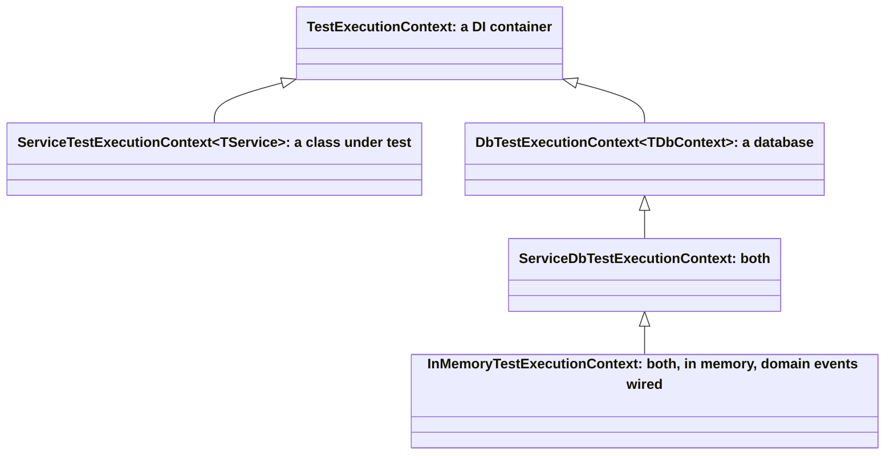

# ADR-005: Как тестируется сервис

**Статус:** принято, 2026-10-03

**Автор:** Владимир Савкин, создатель DotNetSolutionKit

## Контекст

Сервис .NET обычно тестируют в одном из двух стилей.

- **Изолированные модульные тесты.** Тестируемый класс получает моки на каждую зависимость, включая
  репозитории. Такие тесты быстрые, но мок репозитория отвечает то, что ему велел тест, поэтому тест
  проверяет собственную подготовку, а не код. Запрос с неверным фильтром, пропущенный `Include`,
  сущность, которую так и не добавили в контекст, - ничто из этого такой тест не уронит.
- **Интеграционные тесты через хост** (`WebApplicationFactory` против настоящей базы данных). Они
  проверяют код на настоящей базе, но каждому нужна база, они медленные, и их трудно запускать
  параллельно. В итоге команда пишет на один сценарий и модульный, и интеграционный тест или пропускает
  один из них.

Большая часть работы сервиса лежит между этими двумя: сценарий загружает агрегаты через репозитории,
меняет их, поднимает доменные события и сохраняет. Чтобы это протестировать, нужны настоящие репозитории
и настоящий `DbContext`, а HTTP и PostgreSQL не нужны.

## Решение

Каждый вид кода получает самый дешёвый тест, который может упасть, когда код неверен.

| Вид | Что тестирует | Чем строится | Что заменено |
|---|---|---|---|
| Модульный | Сущности, объекты-значения, политики, валидаторы, чистые вспомогательные функции | `new`, без контейнера | ничего |
| Сервисный (sociable) | Прикладные сервисы и сценарии | `InMemoryTestExecutionContext<TService, TDbContext>` | только то, что выходит за пределы сервиса: почта, токены, другие сервисы, время |
| Потребитель | Потребители сообщений | тот же контекст, где тестируемый класс - потребитель, и собранный `ConsumeContext` | как для сервиса |
| Обработчик событий | Обработчики доменных событий | обработчик с моками его портов | порты, которые вызывает обработчик |
| Задача | Фоновые задачи | задача с моками её портов | порты, которыми задача управляет; тест проверяет вызовы |
| Конвейер | То, через что проходит запрос: валидация, ошибки, права, пагинация | тестовый сервер (`Microsoft.AspNetCore.TestHost`) | внешний мир |
| Контракт | Документ OpenAPI | `SchemaHost.Build` в режиме только схемы | инфраструктура |
| Правило | Правила о самом коде: каждая аудируемая сущность помечена, каждый ключ флага существует | рефлексия по сборкам | ничего |
| Интеграционный | То, что зависит от PostgreSQL | настоящая база данных, `[Integration]` | ничего |

### Сервис и потребитель: настоящий контейнер и база на каждый тест

`TestExecutionContext` из `Common.Testing` запускает тестируемый класс с его настоящими соседями; этот
стиль известен как sociable unit tests.

- **Настоящий DI-контейнер на каждый тест.** Тест регистрирует тестируемый класс, настоящие репозитории
  и `DbContext`; моки стоят только на месте того, что выходит за пределы сервиса.
- **База на каждый тест.** `InMemoryTestExecutionContext` даёт каждому тесту свою базу EF Core в памяти,
  названную по имени теста. Общего состояния у тестов нет, поэтому фикстура запускается с
  `[RunsInParallel]`.
- **Arrange, act и assert в разных областях.** `ArrangeAsync` заполняет данные через одну область,
  `ActAsync` получает тестируемый класс в новой, `AssertAsync` читает базу в третьей. Проверка видит то,
  что сохранено, а не сущность, которую ещё отслеживает изменивший её контекст.
- **Моки переживают смену области.** Мок, зарегистрированный через `Register`, - один и тот же экземпляр
  во всех областях теста, поэтому его настраивают до действия и проверяют после.
- **Доменные события выполняются.** `ActAsync` передаёт область перехватчикам доменных событий, так что
  обработчики pre-save и post-commit выполняются так же, как в сервисе.

```csharp
[TestOf(typeof(OrderService))]
[RunsInParallel]
public class OrderServicePlaceTests : OrderServiceTestBase
{
    [Test(Description = "A placed order is saved with its lines")]
    public async Task Should_SaveTheOrder_When_TheCartHasLines()
    {
        await using var ctx = CreateTestContext();      // real repositories, its own in-memory database
        var customer = await TestFactory.CreateCustomer(ctx);

        var orderId = await ctx.ActAsync(s => s.PlaceAsync(new PlaceOrder(customer.Id, Lines), default));

        await ctx.AssertAsync(async db =>
            (await db.Orders.Include(o => o.Lines).SingleAsync(o => o.Id == orderId)).Lines.Count.ShouldBe(2));
    }
}
```

Тест потребителя устроен так же: `ArrangeAsync` заполняет состояние, `ActAsync` вызывает `Consume` с
собранным `ConsumeContext`, а `AssertAsync` читает то, что сохранил потребитель.

Контексты образуют лестницу, и тест берёт самый маленький подходящий:



### Интеграционные: только то, чему нужен PostgreSQL

Провайдер в памяти - не база данных. На PostgreSQL тестируется следующее, и только оно:

- транзакции, откат и транзакционный outbox;
- внешние ключи, уникальные индексы и другие ограничения;
- поиск без учёта регистра, `ILIKE`, сырой SQL;
- миграции и страж схемы;
- токены конкурентности.

Сервер берётся из переменной окружения `TEST_POSTGRES` (`TEST_SQLSERVER` с `--Database mssql`), её задаёт
агент сборки; без неё тест пропускается с этой причиной, поэтому простой `dotnet test` базы не требует.
Каждый тест получает на этом сервере свою базу, клон базы, мигрированной один раз за прогон.

Сценарий получает один тест самого дешёвого вида, который его покрывает, а не модульный и интеграционный
сразу.

#### Запросы, зависящие от провайдера, уходят за порт

Запрос, который умеет выполнить только PostgreSQL, не обязан покидать сервисные тесты. Пример - поиск без
учёта регистра. Домен объявляет `ICaseInsensitiveSearch`, который возвращает обычную спецификацию; сервис
регистрирует `PostgresCaseInsensitiveSearch`, который строит `EF.Functions.ILike` с экранированием `%`, `_`
и символа экранирования; сервисный тест регистрирует `InMemoryCaseInsensitiveSearch` из `Common.Testing`,
который даёт те же ответы через регулярное выражение: шаблон он берёт у самого
`PostgresCaseInsensitiveSearch`, поэтому оба одинаково экранируют и одинаково сохраняют пробелы вокруг
строки поиска. Код, который ищет, тестируется на базе в памяти, и
PostgreSQL нужен только для самой трансляции в `ILIKE`.

#### Почему репозиториям не нужен интеграционный тест на каждый метод

Репозиторий в основном состоит из общей базы: фильтрация, пагинация, сортировка и включения написаны
один раз в `EntityFrameworkRepository` и один раз протестированы в `Common.Tests`. Конкретный репозиторий
добавляет спецификацию, а это выражение LINQ. Провайдер в памяти выполняет то же выражение на той же
модели, поэтому сервисный тест на `InMemoryTestExecutionContext` уже проверяет, что спецификация выбирает
то, что должна, причём через код, который её использует.

Интеграционный тест того же метода выполнил бы то же выражение ещё раз и мог бы добавить только то, чего
нет у провайдера в памяти, - пункты из списка выше. Поэтому метод репозитория получает интеграционный
тест, когда затрагивает один из них (сырой SQL, `ILIKE`, ограничение, на которое он полагается), и не
получает в остальных случаях. Тест на каждый метод дублирует сервисные тесты и замедляет набор, ничего
нового не ловя.

### Структура и имена

- Одна фикстура на метод класса, в файле с именами обоих: `OrderService.Place.Tests.cs`.
- Один базовый класс на тестируемый класс строит контекст для всех его фикстур: `OrderServiceTestBase`.
- `[TestOf(typeof(...))]` на каждой фикстуре, чтобы поиск по классу находил его тесты.
- Имя теста описывает сценарий в виде `Should_<Outcome>_When_<Condition>`, а `Description` говорит то же
  одним предложением.
- Папки по видам: `Services`, `Consumers`, `EventHandlers`, `Jobs`, `Policies`, `Validation`,
  `Integration`.

## Риски и что с ними делаем

| Риск | Что происходит | Чем закрыт |
|---|---|---|
| `TestExecutionContext` - наша собственная реализация | Поддерживаем его мы, и новичку нужно в нём разобраться | Он небольшой; у частей, которые выглядят лишними, есть комментарий, зачем они нужны; этот ADR и примеры в `Common.Tests` показывают использование. Позже он может уйти в отдельную библиотеку |
| Провайдер в памяти пропускает то, что PostgreSQL отклонил бы | Зелёный тест на запрос, который падает в продакшене | Список выше: всё, что его затрагивает, получает интеграционный тест; ревьюер спрашивает, затрагивает ли его изменение |
| Мок порта расходится с настоящим портом | Тест проходит против поведения, которого у порта уже нет | Моки стоят только на границе сервиса, где контракт - опубликованный интерфейс; у настоящей реализации свои тесты |
| Тесты задачи проверяют вызовы, а не результаты | Задача может делать правильные вызовы и всё равно работать неверно | Задача только управляет; логика, которую она вызывает, тестируется как сервис, по результатам |

## Последствия

- Тестируемый класс работает с настоящими репозиториями и контекстом, поэтому неверный запрос или
  пропущенное сохранение роняют тест.
- Большинству тестов не нужны ни база данных, ни сеть, ни хост.
- База на каждый тест и отсутствие общего состояния позволяют запускать все фикстуры параллельно.
- Тест через `Register` заменяет ровно тех соседей, которых выбрал, а остальных оставляет настоящими:
  один сервис можно тестировать с настоящим репозиторием и моком отправителя почты, следующий - с обоими
  настоящими.
- Контексты образуют лестницу, и тест берёт самый маленький подходящий: `TestExecutionContext` для одного
  контейнера, `ServiceTestExecutionContext<TService>` для класса без базы данных,
  `DbTestExecutionContext<TDbContext>` для базы без тестируемого класса,
  `ServiceDbTestExecutionContext<TService, TDbContext>` для обоих и `InMemoryTestExecutionContext` для
  обоих на провайдере в памяти с подключёнными доменными событиями.
- `ArrangeAsync`, `ActAsync` и `AssertAsync` читаются как три шага теста, по одному вызову на шаг, без
  хоста, порта и HTTP-клиента, которые надо было бы настраивать.
- Сценарий получает один тест самого дешёвого вида, который его покрывает; интеграционные тесты пишутся
  только для случаев из списка выше.
