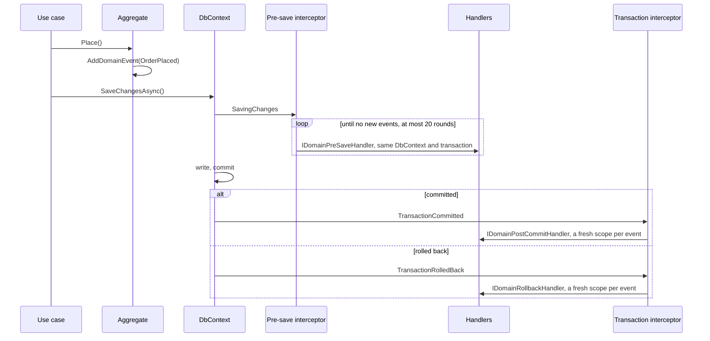

# Domain events

An aggregate raises an event; handlers react to it in one of three phases of the save. Why three phases
and not MediatR: [ADR-001](../adr/001-three-phase-domain-events.md). The rules of each phase:
[Events/Readme.md](../../template/src/common/NamespaceRoot.ProductName.Common.Application/Events/Readme.md).

## Raise

An entity that raises events derives from `AggregateRoot<TId>` or `EventfulEntity<TId>`:

```csharp
public sealed record OrderPlaced(IDomainExecutionContext Context, Guid OrderId) : IDomainEvent;

public class Order : AggregateRoot<Guid>
{
    public void Place(IDomainExecutionContext context)
    {
        Status = OrderStatus.Placed;
        AddDomainEvent(new OrderPlaced(context, Id));
    }
}
```

Saving dispatches the events; the use case does nothing else.

## Handle

One save, from the event to its handlers:



A handler implements the interface of the phase it needs, and lives in the application project, where
`AddDomainEvents` finds it:

| Interface | Runs | Use for |
|---|---|---|
| `IDomainPreSaveHandler<TEvent>` | in the save, inside its transaction | validation, related changes, a message into the outbox |
| `IDomainPostCommitHandler<TEvent>` | after the commit, in a fresh scope | e-mail, enqueuing a job, a follow-up write in its own transaction |
| `IDomainRollbackHandler<TEvent>` | after a rollback, in a fresh scope | compensation, logging |

The phase before the save and the phase after the commit take one `Handle` method, so a class implementing
both for one event would run it twice; the registration refuses it at startup and names the class. Make it
two classes. A rollback handler has `HandleRollback` of its own and goes with either.

"After the commit" means after the write is final, which happens in one of three ways: a transaction
commits; a save with no transaction open around it returns (EF Core sends a single statement without a
transaction, so no transaction event comes); or, on a provider without relational transactions such as
the in-memory one of the service tests, `CommitTransactionAsync` returns. A rollback, or a failed save
with no transaction around it, runs the rollback phase the same way. Each phase runs once for the events
of a write.

## Wiring

The service's infrastructure does it when the service is generated:

```csharp
services.AddDomainEvents(typeof(ApplicationMarker).Assembly);
services.AddDbContext<OrdersDbContext>((sp, options) =>
{
    options.UseDatabase(connectionString, OrdersDbContext.DefaultSchemaName);
    options.ApplyDomainEventInterceptors(sp);
});
```

The `DbContext` is registered with `AddDbContext`, not from a pool: a pooled context is handed back
without the interceptors resolved for the new scope, and the events would not be dispatched.

Message consumers and Hangfire jobs dispatch events too: `DomainEventScopeFilter` and
`DomainEventJobActivator` give the interceptors their scope. Code that runs in a scope of its own, such
as a loop in a hosted service, wraps the work in `DomainEventScopeContext.Use(scope.ServiceProvider)`.

## Tests

`Common.Tests` covers the dispatcher, the pre-save cascade, reentrancy on nested commits, the scope filter
and the job activator. Service tests on `InMemoryTestExecutionContext` run handlers as the service does;
see [ADR-005](../adr/005-testing-a-service.md).
