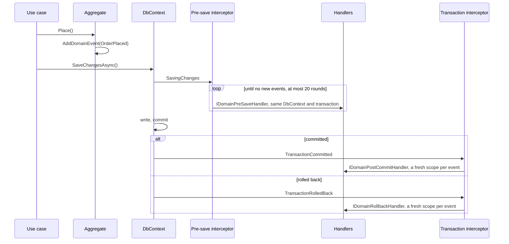

# Доменные события

Агрегат поднимает событие, обработчики реагируют на него в одной из трёх фаз сохранения. Почему три фазы,
а не MediatR: [ADR-001](../adr/001-three-phase-domain-events.md). Правила каждой фазы:
[Events/Readme.md](../../template/src/common/NamespaceRoot.ProductName.Common.Application/Events/Readme.md).

## Поднять событие

Сущность, которая поднимает события, наследуется от `AggregateRoot<TId>` или `EventfulEntity<TId>`:

```csharp
public sealed record OrderPlaced(IDomainExecutionContext Context, Guid OrderId) : IDomainEvent;

public class Order : AggregateRoot<Guid>
{
    public void Place(IDomainExecutionContext context)
    {
        Status = OrderStatus.Placed;
        AddDomainEvent(new OrderPlaced(context, Id));
    }
}
```

События рассылает сохранение; use case больше ничего не делает.

## Обработать событие

Одно сохранение, от события до обработчиков:



Обработчик реализует интерфейс нужной ему фазы и лежит в проекте приложения, где его находит
`AddDomainEvents`:

| Интерфейс | Когда выполняется | Для чего |
|---|---|---|
| `IDomainPreSaveHandler<TEvent>` | при сохранении, внутри его транзакции | валидация, связанные изменения, сообщение в outbox |
| `IDomainPostCommitHandler<TEvent>` | после коммита, в новом scope | e-mail, постановка фоновой задачи, последующая запись в своей транзакции |
| `IDomainRollbackHandler<TEvent>` | после отката, в новом scope | компенсация, логирование |

Фаза при сохранении и фаза после коммита вызывают один и тот же метод `Handle`, поэтому класс, который
реализует обе для одного события, выполнил бы его дважды; регистрация отказывает такому классу на старте и
называет его. Сделайте из него два класса. У обработчика отката свой `HandleRollback`, он сочетается с
любой из двух фаз.

«После коммита» значит после того, как запись стала окончательной, а это бывает одним из трёх путей:
коммитится транзакция; возвращается сохранение, вокруг которого транзакция не открыта (EF Core отправляет
одиночную команду без транзакции, и события транзакции не приходит); или, на провайдере без реляционных
транзакций, как in-memory в сервисных тестах, возвращается `CommitTransactionAsync`. Откат и неудачное
сохранение без транзакции вокруг так же запускают фазу отката. Каждая фаза срабатывает для событий записи
один раз.

## Подключение

Инфраструктура сервиса подключает события при генерации сервиса:

```csharp
services.AddDomainEvents(typeof(ApplicationMarker).Assembly);
services.AddDbContext<OrdersDbContext>((sp, options) =>
{
    options.UseNpgsql(connectionString);
    options.ApplyDomainEventInterceptors(sp);
});
```

`DbContext` регистрируется через `AddDbContext`, а не из пула: контекст из пула выдаётся без
interceptor'ов, разрешённых для нового scope, и события не разошлются.

Консьюмеры сообщений и задачи Hangfire тоже рассылают события: scope для interceptor'ов дают
`DomainEventScopeFilter` и `DomainEventJobActivator`. Код, который работает в собственном scope, например
цикл в hosted service, оборачивает работу в `DomainEventScopeContext.Use(scope.ServiceProvider)`.

## Тесты

`Common.Tests` покрывает диспетчер, каскад pre-save, повторный вход при вложенных коммитах, scope filter и
job activator. Тесты сервиса на `InMemoryTestExecutionContext` запускают обработчики так же, как сервис;
см. [ADR-005](../adr/005-testing-a-service.md).
