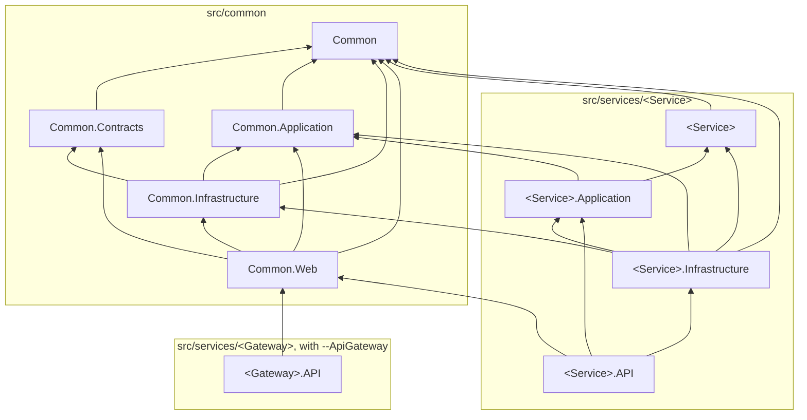

# Projects and layers

A generated solution has two parts: the shared `Common` projects under `src/common`, generated once, and
one folder per service under `src/services`.

Who references whom; an arrow points at the project referenced:

## Common

| Project | Holds | References |
|---|---|---|
| `Common` | The domain kernel: `Entity`, `AggregateRoot`, domain events, `IUnitOfWork`, specifications, the user and execution context, exceptions | nothing |
| `Common.Contracts` | What crosses a service boundary: routes, request and response models, health constants | `Common` |
| `Common.Application` | Application abstractions: the domain event dispatcher, `IPermissionService`, messaging and tracing interfaces | `Common` |
| `Common.Infrastructure` | EF Core base classes, interceptors, repositories, migrations, the schema guard, messaging on MassTransit, security | `Common`, `Common.Application`, `Common.Contracts` |
| `Common.Web` | The web layer of a service: pipeline, errors, validation, Swagger, authentication, permissions, health | `Common`, `Common.Contracts`, `Common.Application`, `Common.Infrastructure` |
| `Common.Tests` | Test infrastructure for services and the tests of `Common` | all of the above |

## A service

| Project | Holds | References |
|---|---|---|
| `<Service>` | The service's domain: entities, aggregates, domain events, policies | `Common` |
| `<Service>.Application` | Use cases, domain event handlers, ports the infrastructure implements | `Common.Application`, the domain |
| `<Service>.Infrastructure` | The `DbContext`, entity configurations, repositories, jobs, consumers | the domain, `Common`, `Common.Application`, `Common.Infrastructure`, the application |
| `<Service>.API` | Controllers, `Program`, the host setup | the `Common` projects, the application, the infrastructure |
| `<Service>.Tests` | The service's tests | `Common.Tests`, `Common` |

The API project does not reference the domain: it works with the domain through the application layer,
which registers the domain services too. The infrastructure references the domain directly, because EF Core
maps the domain's entities and there are no separate persistence models to translate.

## Every reference is explicit

`Directory.Build.props` sets `DisableTransitiveProjectReferences`. A project sees only the projects it
references itself, not the projects those reference. Without it, the API project could use a domain type
through the application project, and the layering above would hold only as long as nobody tried. With it,
crossing a layer is a compile error, and adding a dependency is a visible line in a `.csproj`.

Packages still flow transitively; only project references are cut.

## Packages and versions

Package versions are declared once, in `src/Directory.Packages.props`; a `.csproj` names a package without
a version. Every package is on the .NET 10 line; a package held below its newest version says why next
to it in the file.
