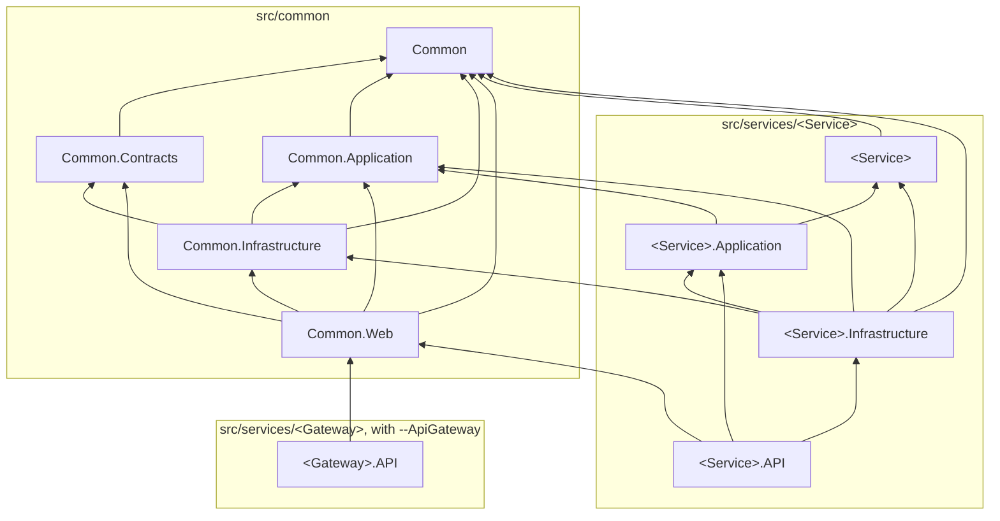

# Проекты и слои

Сгенерированное решение состоит из двух частей: общих проектов `Common` в `src/common`, которые
генерируются один раз, и папки на каждый сервис в `src/services`.

Кто на кого ссылается; стрелка указывает на проект, на который ссылаются:

## Common

| Проект | Что содержит | Ссылается на |
|---|---|---|
| `Common` | Доменное ядро: `Entity`, `AggregateRoot`, доменные события, `IUnitOfWork`, спецификации, пользователь и контекст выполнения, исключения | ни на что |
| `Common.Contracts` | То, что пересекает границу сервиса: маршруты, модели запросов и ответов, константы проверок здоровья | `Common` |
| `Common.Application` | Абстракции приложения: диспетчер доменных событий, `IPermissionService`, интерфейсы сообщений и трассировки | `Common` |
| `Common.Infrastructure` | Базовые классы EF Core, interceptor'ы, репозитории, миграции, schema guard, сообщения на MassTransit, безопасность | `Common`, `Common.Application`, `Common.Contracts` |
| `Common.Web` | Веб-слой сервиса: pipeline, ошибки, валидация, Swagger, аутентификация, права, здоровье | `Common`, `Common.Contracts`, `Common.Application`, `Common.Infrastructure` |
| `Common.Tests` | Тестовая инфраструктура для сервисов и тесты `Common` | все перечисленные выше |

## Сервис

| Проект | Что содержит | Ссылается на |
|---|---|---|
| `<Service>` | Домен сервиса: сущности, агрегаты, доменные события, политики | `Common` |
| `<Service>.Application` | Use case'ы, обработчики доменных событий, порты, которые реализует инфраструктура | `Common.Application`, домен |
| `<Service>.Infrastructure` | `DbContext`, конфигурации сущностей, репозитории, фоновые задачи, консьюмеры | домен, `Common`, `Common.Application`, `Common.Infrastructure`, приложение |
| `<Service>.API` | Контроллеры, `Program`, настройка хоста | проекты `Common`, приложение, инфраструктура |
| `<Service>.Tests` | Тесты сервиса | `Common.Tests`, `Common` |

Проект API не ссылается на домен: он работает с доменом через слой приложения, который регистрирует и
доменные сервисы. Инфраструктура ссылается на домен напрямую, потому что EF Core маппит сущности домена и
отдельных моделей хранения, которые пришлось бы переводить, нет.

## Каждая ссылка явная

`Directory.Build.props` включает `DisableTransitiveProjectReferences`. Проект видит только те проекты,
на которые ссылается сам, а не проекты, на которые ссылаются они. Без этого проект API мог бы
использовать доменный тип через проект приложения, и описанные выше слои держались бы, только пока никто
не попробовал. С этим пересечение слоя - ошибка компиляции, а новая зависимость - видимая строка в
`.csproj`.

Пакеты по-прежнему подтягиваются транзитивно; отрезаны только ссылки на проекты.

## Пакеты и версии

Версии пакетов объявлены один раз, в `src/Directory.Packages.props`; `.csproj` называет пакет без
версии. Все пакеты остаются на линейке .NET 8: ни один не тянет библиотеку .NET 9, ни напрямую, ни
транзитивно, поэтому часть пакетов держится ниже последней версии.
