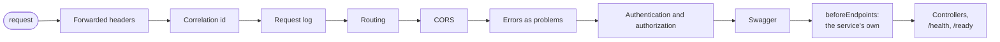

# Web layer

The host of every service is built from three calls in `Common.Web`, so the pipeline is the same in all
services and a fix to it reaches them with a `Common` update.

| Call | Registers or adds |
|---|---|
| `builder.AddPlatformLogging()` | Serilog from the `Serilog` section, with the version and the module on every line; health probes kept out of the log |
| `builder.AddPlatformWebApi(serviceAssembly, mvc => ...)` | [JSON](#json), [errors](errors.md), controllers with the [permission check](authentication-and-permissions.md), [validation](validation-and-pagination.md), Swagger, CORS from the `Cors` section, the execution context |
| `app.UsePlatformPipeline(serviceAssembly, authenticate, beforeEndpoints)` | the middleware, in the order below, and the endpoints |

## JSON

Every service serializes with `PlatformJson` from `Common.Application`: the controllers, minimal APIs,
`/health` and `/ready`, and any code that writes JSON itself through `PlatformJson.Options`.

| Value | On the wire |
|---|---|
| Property names | camelCase |
| `null` | left out |
| Enums | names: `"ApiKey"`, not `1` |
| `DateTimeOffset` | UTC with `Z`, fractional seconds only when present: `"2026-01-19T12:30:00Z"`; an offset read in is converted to UTC |
| Non-ASCII text | as is, not as `\uXXXX` escapes |

A number for an enum means nothing in a log, and reordering the enum changes the meaning of numbers
already stored or sent. A timestamp in the server's own offset makes two services describe one instant
differently, and clients comparing the strings get it wrong across a daylight-saving change.

## The pipeline



1. Forwarded headers: the scheme and the client address from `X-Forwarded-Proto` and
   `X-Forwarded-For`, as the proxy in front saw them. First, so the log, the cookies and anything that
   checks for HTTPS see the client's request, not the proxy's. See [behind a proxy](#behind-a-proxy).
2. Correlation: reads or creates `X-Correlation-Id`, puts it on every log line of the request and on the
   response.
3. Request logging: one line per request with method, path, status and duration. It comes after
   correlation, so the line carries the identifier.
4. Routing.
5. CORS. Before error handling, so an error reaches a browser with CORS headers instead of as an opaque
   network failure.
6. Error handling: exceptions and empty 4xx/5xx responses become [problems](errors.md).
7. Authentication and authorization. After error handling, so their failures are problems too.
8. Swagger.
9. The service's own middleware, from `beforeEndpoints`: the Hangfire dashboard, for instance.
10. Controllers, `/health` and `/ready`.

## Behind a proxy

By default the forwarded headers are accepted from any address: in containers the proxy's address
changes, and the deployment files publish a service on the host's loopback only, so nothing but the
proxy reaches it. A service reachable from elsewhere lists its proxies, and the headers from any other
address are ignored:

| Setting | |
|---|---|
| `ForwardedHeaders:KnownProxies` | addresses of the proxies, `["10.0.0.2"]` |
| `ForwardedHeaders:KnownNetworks` | their networks, `["10.1.0.0/16"]` |
| `ForwardedHeaders:ForwardLimit` | how many proxies the request passes through, 1 by default |

## Swagger documents

The version of an endpoint is the `api/v{n}` segment of its route. Swagger shows one document per version
found on the service's controllers, `v1`, `v2`, `v10` in numeric order, and an `all` document with every
endpoint. A route without a version, such as `internal/jobs`, is listed only in `all`. The
[API diff](../features/api-diff.md) compares the `all` document.

## What a service keeps

```csharp
// SchemaHost.Build
builder.AddPlatformLogging();
builder.Configuration.SetupAppConfiguration(builder.Environment, args);
builder.AddPlatformWebApi(typeof(SchemaHost).Assembly);
builder.SetupAppServices()          // its own registrations
    .SetupHealthChecks();           // its database, its jobs
builder.SetupAppAuthentication();   // its authentication handler

// Program
var app = SchemaHost.Build(args);
// migrations and seeding
app.UsePlatformPipeline(typeof(Program).Assembly, beforeEndpoints: pipeline => pipeline.UseAppHangfire());
app.Run();
```

Configuration, the service's own registrations, health checks, the authentication handler and the
database setup stay in the service; everything else is shared. `SchemaHost.Build` describes the
application once, for `Program` and for the [API document](../adr/003-api-schema-generation.md).

The DI container is validated when it is built, in every environment: a missing registration or a scoped
service taken from the root fails the start, not the first request that needs it.

## Tests

`Common.Tests` builds a host with `AddPlatformWebApi` and `UsePlatformPipeline` on a test server and
checks health, an unknown route answered as a problem with the correlation identifier, and CORS for a
configured origin.
