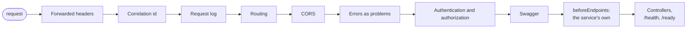

# Веб-слой

Хост каждого сервиса собирается из трёх вызовов `Common.Web`, поэтому pipeline одинаков во всех
сервисах, а исправление в нём доходит до них с обновлением `Common`.

| Вызов | Что регистрирует или добавляет |
|---|---|
| `builder.AddPlatformLogging()` | Serilog из секции `Serilog`, с версией и модулем в каждой строке; запросы проверок здоровья в лог не попадают |
| `builder.AddPlatformWebApi(serviceAssembly, mvc => ...)` | [JSON](#json), [ошибки](errors.md), контроллеры с [проверкой прав](authentication-and-permissions.md), [валидацию](validation-and-pagination.md), Swagger, CORS из секции `Cors`, контекст выполнения |
| `app.UsePlatformPipeline(serviceAssembly, authenticate, beforeEndpoints)` | middleware в порядке ниже и endpoints |

<a id="json"></a>
## JSON

Все сервисы сериализуют через `PlatformJson` из `Common.Application`: контроллеры, minimal API, `/health`
и `/ready`, а также любой код, который сам пишет JSON через `PlatformJson.Options`.

| Значение | В ответе |
|---|---|
| Имена свойств | camelCase |
| `null` | опускается |
| Enum | имена: `"ApiKey"`, а не `1` |
| `DateTimeOffset` | UTC с `Z`, доли секунды только если они есть: `"2026-01-19T12:30:00Z"`; входящее смещение переводится в UTC |
| Не-ASCII текст | как есть, без экранирования `\uXXXX` |

Число вместо enum ничего не говорит в логе, а перестановка значений enum меняет смысл уже сохранённых или
отправленных чисел. Время в собственном смещении сервера заставляет два сервиса описывать один момент
по-разному, и клиенты, сравнивающие строки, ошибаются при переходе на летнее время.

## Pipeline



1. Forwarded headers: схема и адрес клиента из `X-Forwarded-Proto` и `X-Forwarded-For`, как их видел
   прокси перед сервисом. Идут первыми, чтобы лог, cookie и всё, что проверяет HTTPS, видели запрос
   клиента, а не прокси. См. [за прокси](#за-прокси).
2. Корреляция: читает или создаёт `X-Correlation-Id`, ставит его в каждую строку лога запроса и в ответ.
   См. [корреляцию](#корреляция).
3. Лог запросов: одна строка на запрос с методом, путём, статусом и длительностью. Идёт после корреляции,
   поэтому строка несёт идентификатор.
4. Маршрутизация.
5. CORS. До обработки ошибок, чтобы ошибка дошла до браузера с CORS-заголовками, а не как непрозрачный
   сетевой сбой.
6. Обработка ошибок: исключения и пустые ответы 4xx/5xx становятся [problem](errors.md).
7. Аутентификация и авторизация. После обработки ошибок, поэтому их отказы тоже становятся problem.
8. Swagger.
9. Собственный middleware сервиса из `beforeEndpoints`, например дашборд Hangfire.
10. Контроллеры, `/health` и `/ready`.

<a id="correlation"></a>
## Корреляция

Идентификатор корреляции связывает один внешний запрос со всем, что он вызвал. Вызывающий может прислать
свой в `X-Correlation-Id`; без него запрос берёт свой trace id. Поиск по этому идентификатору в логах
всех сервисов находит запрос, опубликованные им сообщения, их консьюмеры, поставленные ими фоновые задачи
и вызовы других сервисов, каждую строку в свойстве `CorrelationId`:

| Куда уходит работа | Как туда попадает идентификатор |
|---|---|
| сообщение | заголовок `X-Correlation-Id` сообщения, восстанавливается для консьюмера ([сообщения](../features/messaging.md)) |
| задача Hangfire | параметр задачи, восстанавливается на время её выполнения ([фоновые задачи](../features/background-jobs.md)) |
| другой сервис | заголовок `X-Correlation-Id` вызова ([вызов другого сервиса](authentication-and-permissions.ru.md#вызов-другого-сервиса)) |

Трасса (`traceparent`) пересекает те же границы. Идентификатор передаётся отдельно, потому что
вызывающий, приславший свой, ищет по нему, а трасса не несёт его дальше первого сервиса. Внутри процесса
идентификатор текущей работы - `Correlation.Current`.

<a id="behind-a-proxy"></a>
## За прокси

По умолчанию forwarded-заголовки принимаются с любого адреса: в контейнерах адрес прокси меняется, а
файлы развёртывания публикуют сервис только на loopback хоста, так что до него доходит только прокси.
Сервис, доступный откуда-то ещё, перечисляет свои прокси, и заголовки с любого другого адреса
игнорируются:

| Настройка | |
|---|---|
| `ForwardedHeaders:KnownProxies` | адреса прокси, `["10.0.0.2"]` |
| `ForwardedHeaders:KnownNetworks` | их сети, `["10.1.0.0/16"]` |
| `ForwardedHeaders:ForwardLimit` | через сколько прокси проходит запрос, по умолчанию 1 |

<a id="swagger-documents"></a>
## Документы Swagger

Версия endpoint - сегмент `api/v{n}` его маршрута. Swagger показывает по документу на каждую версию,
найденную в контроллерах сервиса, `v1`, `v2`, `v10` в числовом порядке, и документ `all` со всеми
endpoints. Маршрут без версии, например `internal/jobs`, есть только в `all`.
[API diff](../features/api-diff.md) сравнивает документ `all`.

Строковое свойство с закрытым набором значений указывает, где эти значения лежат, и схема их
перечисляет:

```csharp
[SchemaValuesFrom(typeof(OrderStatuses), nameof(OrderStatuses.All))]
public string Status { get; init; }
```

Член - статический список строк или словарь, ключи которого и есть значения. В ответе свойство остаётся
строкой; документ получает `enum` из того же списка, по которому проверяет код.

Две настройки определяют, что получает читатель документа, и у сервиса, и у шлюза; обе проверяются на
старте:

```json
"Swagger": {
  "PublicServers": [ { "Url": "https://api.example.com", "Description": "Production" } ],
  "ScrubPatterns": [ "\\(?\\bPROJ-\\d+\\b\\)?" ]
}
```

- `PublicServers` становятся `servers` документа, и клиент, который его импортирует, например Postman,
  знает, куда слать запросы. Каждый - абсолютный URL со схемой; хост с переменной сервера вместо этого
  Postman отверг при импорте документа как OpenAPI 3.0. Без них `servers` нет, и базовый адрес - тот,
  откуда пришёл документ: это верно для локального запуска.
- `ScrubPatterns` - регулярные выражения, совпадения с которыми убираются из всех описаний документа.
  XML-комментарий может называть задачу, из которой пришло решение, а Swashbuckle копирует его дословно;
  читатель контракта получает текст без ссылок на трекер, который он не может открыть, а в коде они
  остаются.

## Что остаётся в сервисе

```csharp
// SchemaHost.Build
builder.AddPlatformLogging();
builder.Configuration.SetupAppConfiguration(builder.Environment, args);
builder.AddPlatformWebApi(typeof(SchemaHost).Assembly);
builder.SetupAppServices()          // its own registrations
    .SetupHealthChecks();           // its database, its jobs
builder.SetupAppAuthentication();   // its authentication handler

// Program
var app = SchemaHost.Build(args);
// migrations and seeding
app.UsePlatformPipeline(typeof(Program).Assembly, beforeEndpoints: pipeline => pipeline.UseAppHangfire());
app.Run();
```

Конфигурация, собственные регистрации сервиса, проверки здоровья, обработчик аутентификации и настройка
базы остаются в сервисе; всё остальное общее. `SchemaHost.Build` описывает приложение один раз, для
`Program` и для [API-документа](../adr/003-api-schema-generation.md).

DI-контейнер проверяется при сборке в любом окружении: отсутствующая регистрация или scoped-сервис,
взятый из корня, роняют старт, а не первый запрос, которому он нужен.

## Тесты

`Common.Tests` собирает хост с `AddPlatformWebApi` и `UsePlatformPipeline` на тестовом сервере и
проверяет health, неизвестный маршрут, на который приходит problem с идентификатором корреляции, и CORS
для настроенного origin.
