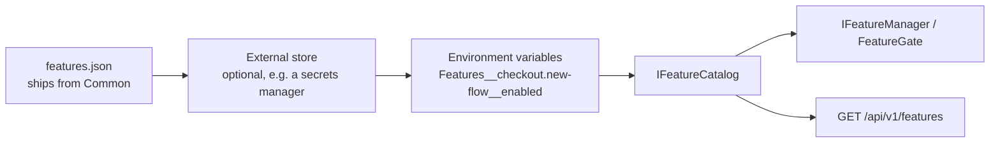

# Feature Flags

A flag answers one question: *is this behaviour on right now?* Everything here follows from treating
the answer as **data** rather than as code — data that ships in one file, is read the same way by every
service, can be changed on a running system, and carries enough about itself that nobody has to ask who
added it or whether it can go.

## Why one file

A flag that lives in a service's `appsettings.json` means whatever that service thinks it means. Two
services then disagree about the same feature, and a flag that spans them — a migration, a kill switch,
a redesign visible in three places — has to be set in three files, in the right order, without anyone
forgetting the third.

So flags live in a single `features.json` that ships from `Common`. It travels with the project
reference, lands in every service's output, and is read by all of them. One flag, one meaning, one place
to change it. Adding a flag that only the UI reacts to needs no code at all — a new entry in the file is
the whole change.

The file is also the fallback. When an external store is wired up and unreachable, the platform keeps
running on what the file says instead of failing to start or silently answering `false` to everything.

## The schema

```json
{
  "Features": {
    "checkout.new-flow": {
      "enabled": false,
      "effect": "enables",
      "environments": { "Development": true, "Staging": true },
      "tags": ["checkout", "migration"],
      "description": "Serve the rebuilt checkout instead of the original.",
      "owner": "payments",
      "expiresAt": "2026-12-31",
      "ticket": "ABC-123"
    }
  }
}
```

| Field | Meaning |
|---|---|
| `enabled` | The default value, used by any environment the `environments` map does not name. |
| `effect` | `enables` or `disables` — whether *on* means the feature works or is withheld. |
| `environments` | Per-environment override, matched against the running `IHostEnvironment.EnvironmentName`, case-insensitively. This is what lets one shared file serve every stand. |
| `tags` | Free labels for grouping in a management view: an area, a release, a squad. |
| `description` | What the flag does, written for whoever finds it in a year. |
| `owner` | Who to ask. A flag with no owner is a flag nobody dares delete. |
| `expiresAt` | When it should be gone. Past that date the flag is reported as **expired** — it keeps working, but the debt is visible instead of remembered. |
| `ticket` | Where the decision was recorded. Deliberately a plain string: it survives a change of tracker. |

Keys are lower kebab-case, dotted for sub-features (`billing.invoice.recurring`), and are matched
without regard to case in both directions — `Checkout.New-Flow` and `checkout.new-flow` are one flag.
What is reported back is always the spelling declared in the file, so a management view shows the
canonical name rather than whatever a caller typed.

**Write flags so that *on* means the feature works.** A kill switch is the exception, and `effect`
exists so it can say so instead of relying on everyone remembering that this one is backwards.

## Layers, and which one won

Values resolve through `IConfiguration`, so they are layered, and the order is deliberate:



Later layers win. Each state reports **which layer decided it** — `File`, `Store`, `EnvironmentVariable`
or `Default` — which exists for one situation that is otherwise unexplainable from the outside: an
operator switches a flag off, nothing happens, because an environment variable on the host sits above
the file. Without the source in the response, that is an afternoon of confusion.

The file is registered with `reloadOnChange`, and the catalogue reads configuration on **every call**
rather than caching. That is what makes an edit apply to a running service. Caching a value here would
quietly undo the whole property.

## Reading a flag

Two calls, and nothing to declare. The file joins configuration:

```csharp
builder.AddPlatformFeatures();   // IConfigurationBuilder, before every other layer
```

and the mechanism joins the container:

```csharp
services.AddPlatformFeatureManagement(configuration);
```

`AddPlatformFeatures` anchors the file to the application's base directory rather than the content
root. The file ships in the build output, and a relative path resolves against the content root — the
project directory under `dotnet run`, the application directory in a container. Anchoring makes both
agree instead of working in one and silently reading nothing in the other.

After it:

| Use | What |
|---|---|
| Evaluate in code | `IFeatureManager` from `Microsoft.FeatureManagement`, backed by the shared file |
| Guard an endpoint | `[FeatureGate(FeatureKeys.SomeFeature)]` — the route is absent while the flag is off |
| Read the platform view | `IFeatureCatalog` — value plus owner, expiry, tags and the deciding layer |
| Change a value | `IFeatureStore`, or `PUT /api/v1/features/{key}` |

`Microsoft.FeatureManagement` is used rather than replaced: its evaluation, its snapshots and its
`[FeatureGate]` are already written and tested. What this adds is the schema, the shared file, the
source reporting and the write path — not another evaluation engine.

Keys are named through constants:

```csharp
if (_features.IsEnabled(FeatureKeys.CheckoutNewFlow)) { … }
```

`FeatureKeys` is maintained by hand. Generating it from the JSON was considered and dropped — a source
generator maintained forever, to save writing one line, is a bad trade. A test keeps the two honest
instead: every constant must name a flag the file declares. A flag only the UI reacts to needs no
constant at all.

## Changing a value

`IFeatureStore` writes to the file: atomically, through a temporary file and a move, so a reader never
sees half a document. It changes **only the value**. Description, owner, expiry and ticket are decisions
someone recorded, and a write that quietly dropped them would turn the file from a record into state.
A key nothing declares is refused, by name — inventing flags at runtime is how a catalogue stops
describing the system.

Over HTTP:

```
GET  /api/v1/features        → every flag, with value, source, expiry and metadata
PUT  /api/v1/features/{key}  → { "enabled": true, "environment": "Staging" }
```

`GET` is anonymous. Nothing in the list is secret, and a client needs it before anyone signs in — a
login screen that cannot tell which of two login flows to draw is not a hypothetical. `PUT` requires
authorization: it changes how the platform behaves.

**Enforcement stays on the server.** A flag list decides what a client *draws*, never what it is
*permitted* to do. A stale mobile cache is not a security boundary, and neither is a flag.

## Retiring a flag

Every flag ends. `[BehindFeature("key")]` marks the code that exists *because* of the flag — the class,
the method, the property that goes when the flag goes:

```csharp
[BehindFeature(FeatureKeys.CheckoutNewFlow, RemoveWithFeature = true)]
internal sealed class RebuiltCheckoutHandler : ICheckoutHandler { … }
```

Retiring a flag always ends in the question "what can be deleted?". The attribute turns that into a
search rather than an archaeology exercise, and `expiresAt` makes the question arrive on its own rather
than waiting for someone to notice.

## Testing

State the flag where the test is read, not three methods away in configuration setup:

```csharp
[Test, WithFeature(FeatureKeys.CheckoutNewFlow)]
public async Task Should_serve_the_new_checkout() { … }

[Test, WithFeature(FeatureKeys.CheckoutNewFlow, false)]
public async Task Should_serve_the_old_one_when_off() { … }
```

`TestFeatureCatalog` picks those up, and can also be driven directly with `.With(key, enabled)` when a
test flips a flag mid-run. State lives per test in an `AsyncLocal` and is cleared when the test ends,
so a parallel run has nothing shared to race over and nothing left behind for the next test to inherit.

Two guard tests keep the mechanism honest: every constant in `FeatureKeys` names a flag that exists,
and every declared key keeps the agreed shape.

## How a frontend should integrate

The recommendation is deliberately not "call the backend before drawing anything".

**The frontend owns its own flag provider.** It has flags of its own that the backend has no opinion
about — an experiment in a layout, a UI affordance, something a designer wants to try. Those live in the
frontend's own configuration, in the same shape.

**The backend is one more source, above the frontend's own.** `GET /api/v1/features` returns the
platform view; the provider merges it over its local flags — overriding what matches and adding what it
does not have. That gives one useful property: whatever ends up being the shared store (a secrets
manager, a database, a management UI) becomes the single source of truth for *both* backend and
frontend, without either side being rebuilt.

Practical shape:

- Fetch the list when the app loads, and again where it matters — a route change, an admin screen, after
  a user action that depends on one. Asking the backend as the user moves around is ordinary web
  application behaviour, not something to engineer around.
- Treat a failed fetch as "keep the local values", never as "everything is off". A network blip must not
  turn features off for everyone.
- Read flags through the provider only. A component that reaches for configuration directly is the
  component that keeps working after a flag is retired.
- Draw from the flag, but never trust it for permission — the server decides what is allowed, every
  time.

A management UI is then a small application over the same two endpoints: `GET` to list, `PUT` to change,
with owner, expiry, tags and source already in the payload. That is what the schema is for.
