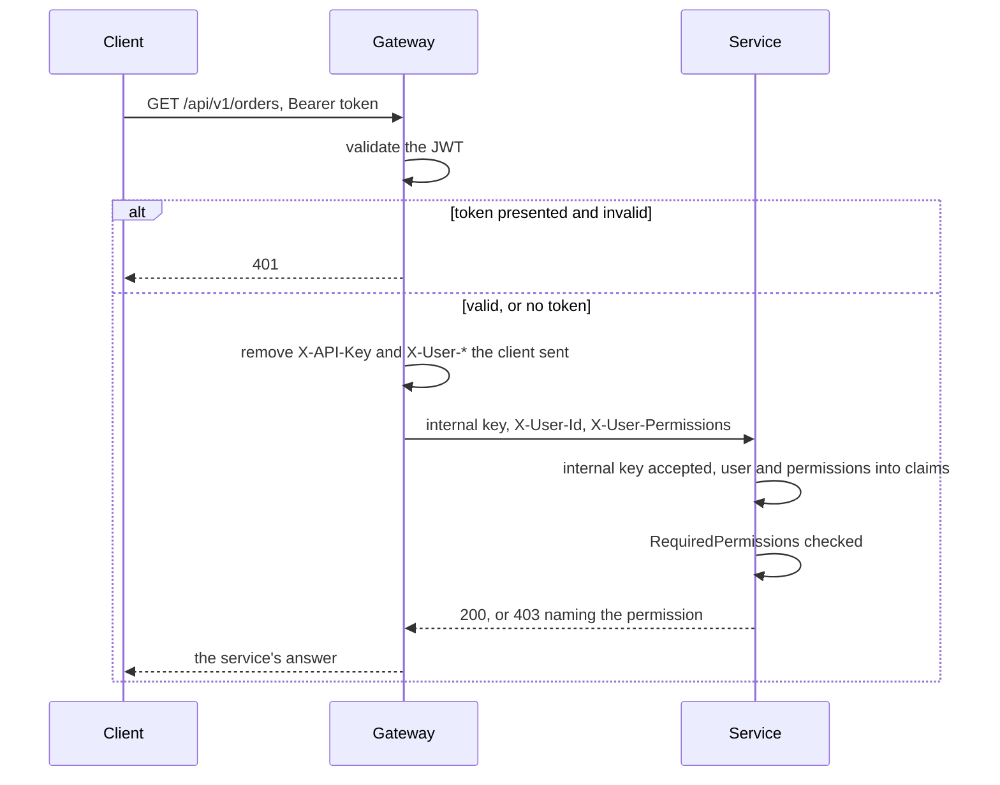

# API gateway

`--ApiGateway` generates a gateway in place of a service: one API project on
[YARP](https://microsoft.github.io/reverse-proxy/), the single public entry point of the solution. It
validates the caller's token, routes the request to a service and tells the service who the caller is.

```bash
# from the solution root, into an existing solution
dotnet new DotNetSolutionKit -N MyCompany -P MyProduct -S Gateway --ApiGateway
```

The gateway is generated with `-M true`, like any further service: it needs the `Common` projects of a
solution already there. With `-M false` the flag has no effect, and the first service is generated as
usual.

## Two shapes

| | Without a gateway | With a gateway |
|---|---|---|
| Who validates the JWT | each service | the gateway |
| How a service knows the user | from its own token | from headers the gateway sets, trusted because the internal API key comes with them |
| Permissions | the `permissions` claims of the token | the same claims, forwarded in `X-User-Permissions` |
| Public entry point | each service | the gateway only |

A service needs no change between the two: its authentication accepts both a JWT and the internal API key
with the forwarded user, and the permission check reads the same claims either way.

## What the gateway does with a request



1. Authentication: the JWT from the `Authorization` header or the access token cookie, checked against
   the public key at `Jwt:PublicKeyPath`, with the issuer and the audience from `Jwt`.
2. A token that was presented and failed (expired, wrong signature) is answered 401 at the gateway. A
   request without a token goes on anonymously, and the service decides whether the endpoint is public.
3. Before the request goes on, the gateway removes `X-API-Key` and every user context header the client
   sent, so nobody can claim to be someone else by setting `X-User-Id`. For an authenticated caller it
   then sets the internal API key and the context from the token: user id, login, display name, tenant,
   roles, permissions, the token id and its expiry.
4. YARP sends the request to the service its route names.

## Routes

Routes and clusters are YARP configuration, in the `ReverseProxy` section of the gateway's
`appsettings.json`, one route and one cluster per service:

```json
"ReverseProxy": {
  "Routes": {
    "orders": { "ClusterId": "orders", "Match": { "Path": "/api/{version}/orders/{**rest}" } }
  },
  "Clusters": {
    "orders": { "Destinations": { "primary": { "Address": "http://orders:8080/" } } }
  }
}
```

Under docker compose the address is the service's name in its compose file; under Kubernetes, its
Service name.

### The services' Swagger

A route `/swagger/<cluster>/{**rest}` with the path transformed to `/swagger/{**rest}` puts the
service's document on the gateway's Swagger page, next to the gateway's own:

```json
"orders-swagger": {
  "ClusterId": "orders",
  "Match": { "Path": "/swagger/orders/{**rest}" },
  "Transforms": [ { "PathPattern": "/swagger/{**rest}" } ]
}
```

The page lists one document per such route, named after the cluster; the list comes from the routes and
has no setting of its own. The gateway serves each one at `/swagger-services/<cluster>.json`, taken from
the cluster's first destination and cut to what a caller of the gateway can reach:

- a path stays when another route of the cluster matches it, and an operation when that route takes its
  method (`Match:Methods`); an endpoint no route reaches answers 404 through the gateway, so it is left
  out, as a `Common` endpoint such as `api/v1/features` is until a route leads to it;
- a route that transforms the path (`PathPattern`, `PathPrefix`, `PathRemovePrefix`, `PathSet`) is not
  followed: the path the service sees is not the one the caller sends;
- the servers are the gateway's (`Swagger:PublicServers`), never the service's, which point past the
  gateway; with none, the base URL is the gateway the document came from.

"Try it out" sends a request to the gateway, which routes it like any other. The services serve their
documents outside Production only, and the gateway serves its page and these copies the same way.

## Settings

| Setting | |
|---|---|
| `Jwt:Issuer`, `Jwt:Audience` | what the tokens carry |
| `Jwt:PublicKeyPath` | the PEM public key the tokens are signed for; the private key stays with whoever issues the tokens |
| `InternalApi:ApiKey` | the key the services accept; it must be the same on the gateway and on every service |
| `Swagger:PublicServers`, `Swagger:ScrubPatterns` | the servers and the clean-up of the documents, as on a service; see [Swagger documents](../architecture/web-layer.md#swagger-documents) |

The deployment files mount the public key: from `deploy/compose/keys/jwt-public.pem` under compose, from
the Secret `<gateway>-jwt` under Kubernetes. The generated `.gitignore` keeps `*private*.pem` out of the
repository.

## Checked

On a generated solution under compose, a service and a gateway in front of it:

| Request | Answer |
|---|---|
| valid token | 200, the service sees the user's id and login |
| valid token, an action needing a permission the token has | 200 |
| valid token, an action needing a permission the token lacks | 403, naming the permission |
| expired token, token signed with another key | 401 at the gateway |
| no token, to an action that needs a user | 401 from the service |
| `X-User-Id` set by the client, through the gateway | 401: the header is removed |
| `X-User-Id` sent straight to the service, without the key or with a wrong one | 401 |

`Common.Tests` covers what the gateway forwards and what it refuses.
