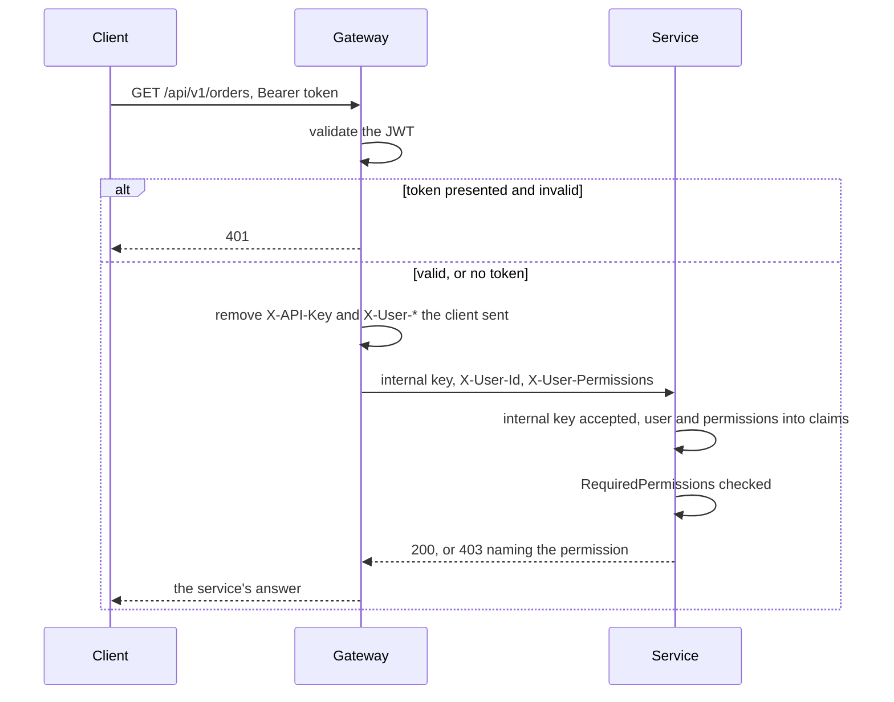

# API-шлюз

`--ApiGateway` генерирует шлюз вместо сервиса: один API-проект на
[YARP](https://microsoft.github.io/reverse-proxy/), единственную публичную точку входа в решение. Шлюз
проверяет токен вызывающего, направляет запрос в сервис и сообщает сервису, кто вызывает.

```bash
# from the solution root, into an existing solution
dotnet new DotNetSolutionKit -N MyCompany -P MyProduct -S Gateway --ApiGateway
```

Шлюз генерируется с `-M true`, как любой следующий сервис: ему нужны проекты `Common` уже существующего
решения. С `-M false` флаг ни на что не влияет, и первый сервис генерируется как обычно.

## Две схемы

| | Без шлюза | Со шлюзом |
|---|---|---|
| Кто проверяет JWT | каждый сервис | шлюз |
| Откуда сервис знает пользователя | из своего токена | из заголовков, которые ставит шлюз; им доверяют, потому что с ними приходит внутренний API-ключ |
| Права | claims `permissions` из токена | те же claims, пересланные в `X-User-Permissions` |
| Публичная точка входа | каждый сервис | только шлюз |

Сервис между двумя схемами не меняется: его аутентификация принимает и JWT, и внутренний API-ключ с
пересланным пользователем, а проверка прав читает одни и те же claims в обоих случаях.

## Что шлюз делает с запросом



1. Аутентификация: JWT из заголовка `Authorization` или из cookie с access token проверяется по
   публичному ключу из `Jwt:PublicKeyPath`, с issuer и audience из `Jwt`.
2. На предъявленный и не прошедший проверку токен (истёк, чужая подпись) шлюз отвечает 401. Запрос без
   токена идёт дальше анонимно, и сервис решает, публичный ли эндпоинт.
3. Перед тем как передать запрос, шлюз удаляет `X-API-Key` и все заголовки контекста пользователя,
   присланные клиентом, чтобы никто не выдал себя за другого, выставив `X-User-Id`. Для
   аутентифицированного вызывающего шлюз затем ставит внутренний API-ключ и контекст из токена: id
   пользователя, логин, отображаемое имя, тенант, роли, права, id токена и срок его действия.
4. YARP отправляет запрос в сервис, названный в маршруте.

## Маршруты

Маршруты и кластеры - это конфигурация YARP, в секции `ReverseProxy` файла `appsettings.json` шлюза,
по одному маршруту и одному кластеру на сервис:

```json
"ReverseProxy": {
  "Routes": {
    "orders": { "ClusterId": "orders", "Match": { "Path": "/api/{version}/orders/{**rest}" } }
  },
  "Clusters": {
    "orders": { "Destinations": { "primary": { "Address": "http://orders:8080/" } } }
  }
}
```

Под docker compose адрес - имя сервиса в его compose-файле, под Kubernetes - имя его Service.

### Swagger сервисов

Маршрут `/swagger/<кластер>/{**rest}`, у которого путь преобразуется в `/swagger/{**rest}`, ставит
документ сервиса на страницу Swagger шлюза, рядом с документом самого шлюза:

```json
"orders-swagger": {
  "ClusterId": "orders",
  "Match": { "Path": "/swagger/orders/{**rest}" },
  "Transforms": [ { "PathPattern": "/swagger/{**rest}" } ]
}
```

Страница перечисляет по документу на каждый такой маршрут, с именем кластера; список - это сами маршруты, а
не вторая настройка. «Try it out» отправляет запрос шлюзу, и тот маршрутизирует его как любой другой.
Сервисы отдают документы только вне Production, так же как шлюз показывает свою страницу.

## Настройки

| Настройка | |
|---|---|
| `Jwt:Issuer`, `Jwt:Audience` | то, что несут токены |
| `Jwt:PublicKeyPath` | публичный PEM-ключ, которым проверяется подпись токенов; приватный ключ остаётся у того, кто выпускает токены |
| `InternalApi:ApiKey` | ключ, который принимают сервисы; он должен совпадать на шлюзе и на каждом сервисе |

Файлы деплоя монтируют публичный ключ: из `deploy/compose/keys/jwt-public.pem` под compose, из Secret
`<gateway>-jwt` под Kubernetes. Сгенерированный `.gitignore` не пускает `*private*.pem` в репозиторий.

## Проверено

На сгенерированном решении под compose, сервис и шлюз перед ним:

| Запрос | Ответ |
|---|---|
| валидный токен | 200, сервис видит id и логин пользователя |
| валидный токен, действие требует права, которое в токене есть | 200 |
| валидный токен, действие требует права, которого в токене нет | 403 с названием права |
| истёкший токен, токен подписан другим ключом | 401 на шлюзе |
| без токена, к действию, которому нужен пользователь | 401 от сервиса |
| `X-User-Id` выставлен клиентом, через шлюз | 401: заголовок удаляется |
| `X-User-Id` отправлен прямо в сервис, без ключа или с неверным | 401 |

`Common.Tests` покрывает, что шлюз пересылает и что отклоняет.
