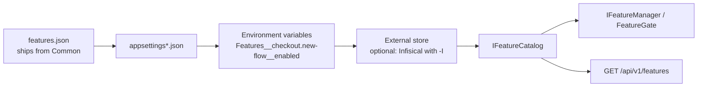

# Feature flags

Generated with `--FeatureFlags`, off by default. Pass it with `-M false`, and to each service generated
later that reads the flags.

A flag answers one question: *is this behaviour on right now?* The answer is kept as data. It ships in
one file, every service reads it the same way, it can be changed on a running system, and it carries
enough about itself that nobody has to ask who added it or whether it can go.

## Why one file

A flag that lives in a service's `appsettings.json` means whatever that service thinks it means. Two
services then disagree about the same feature, and a flag that spans them - a migration, a kill switch,
a redesign visible in three places - has to be set in three files, in the right order, without anyone
forgetting the third.

So flags live in a single `features.json` that ships from `Common`. It travels with the project
reference, lands in every service's output, and is read by all of them. Each flag has one meaning and is
changed in one place. Adding a flag that only the UI reacts to needs no code at all - a new entry in the
file is the whole change.

The file is also the fallback. When an external store is wired up and unreachable, the platform keeps
running on what the file says instead of failing to start or silently answering `false` to everything.

## The schema

```json
{
  "Features": {
    "checkout.new-flow": {
      "enabled": false,
      "effect": "enables",
      "environments": { "Development": true, "Staging": true },
      "tags": ["checkout", "migration"],
      "description": "Serve the rebuilt checkout instead of the original.",
      "owner": "payments",
      "expiresAt": "2026-12-31",
      "ticket": "ABC-123"
    }
  }
}
```

| Field | Meaning |
|---|---|
| `enabled` | The default value, used by any environment the `environments` map does not name. |
| `effect` | `enables` or `disables` - whether *on* means the feature works or is withheld. |
| `environments` | Per-environment override, matched against the running `IHostEnvironment.EnvironmentName`, case-insensitively. This is what lets one shared file serve every stand. |
| `tags` | Free labels for grouping in a management view: an area, a release, a squad. |
| `description` | What the flag does, written for whoever finds it in a year. |
| `owner` | Who to ask. A flag with no owner is a flag nobody dares delete. |
| `expiresAt` | When it should be gone. Past that date the flag is reported as **expired** - it keeps working, but the debt is visible instead of remembered. |
| `ticket` | Where the decision was recorded. Deliberately a plain string: it survives a change of tracker. |
| `pinned` | `true` makes the file's `enabled` and `environments` win over every other layer; see [pinning a flag](#pinning-a-flag). |

Keys are lower kebab-case, dotted for sub-features (`billing.invoice.recurring`), and are matched
without regard to case in both directions - `Checkout.New-Flow` and `checkout.new-flow` are one flag.
What is reported back is always the spelling declared in the file, so a management view shows the
canonical name rather than whatever a caller typed.

**Write flags so that *on* means the feature works.** A kill switch is the exception, and `effect`
exists so it can say so instead of relying on everyone remembering that this one is backwards.

## Layers, and which one won

Values resolve through `IConfiguration`, so they are layered in this order:



Later layers win, except over a [pinned](#pinning-a-flag) flag. Each state reports **which layer decided
it** - `File`, `Store`, `EnvironmentVariable`, `Default` or `Pinned`. The source explains a case that
cannot be seen from the outside: an operator switches a flag off in the file and nothing happens,
because an environment variable or the store sits above it.

The external store is read at startup and again every `ReloadSeconds` (300 by default; 0 reads it at
startup only). A flag changed there applies within that time, without a restart: the catalogue reads
configuration on every call. While the store cannot be reached, a service can start on a
[snapshot](secrets.md#when-the-store-is-unreachable) of what it last read.

### Pinning a flag

A flag with `"pinned": true` in `features.json` takes its value from the file alone, over the store, its
snapshot and environment variables. It is for one flag that has to change now: the store is down and the
service runs on its snapshot, or the store holds a value that must not apply here for a while. The file
is edited, the flag pinned, and nothing else is touched; the store keeps its value until the pin is taken
off.

- Only the file can pin: `pinned` set in the store or an environment variable is ignored, so the store
  cannot lock itself in.
- A pinned flag reports `Pinned` as its source, and every start logs a warning naming the pinned flags,
  so a pin left after the outage does not quietly keep overriding the store.

The file is registered with `reloadOnChange`, and the catalogue reads configuration on every call and
caches nothing, so an edit applies to a running service.

## Reading a flag

Two calls, and nothing to declare. The file joins configuration:

```csharp
builder.AddPlatformFeatures();   // IConfigurationBuilder, before every other layer
```

and the mechanism joins the container:

```csharp
services.AddPlatformFeatureManagement(configuration);
```

`AddPlatformFeatures` anchors the file to the application's base directory rather than the content
root. The file ships in the build output, and a relative path resolves against the content root - the
project directory under `dotnet run`, the application directory in a container. With a relative path
one of the two would silently read nothing; anchored, the file is found in both.

After it:

| Use | What |
|---|---|
| Evaluate in code | `IFeatureManager` from `Microsoft.FeatureManagement`, backed by the shared file |
| Guard an endpoint | `[FeatureGate(FeatureKeys.SomeFeature)]` - while the flag is off the route answers 404 and is left out of the Swagger document |
| Read the platform view | `IFeatureCatalog` - value plus owner, expiry, tags and the deciding layer |
| Change a value | `IFeatureStore`, or `PUT /api/v1/features/{key}` |

Evaluation stays with `Microsoft.FeatureManagement`: its evaluation, its snapshots and its
`[FeatureGate]` are already written and tested. The template adds the schema, the shared file, the
source reporting and the write path.

Keys are named through constants:

```csharp
if (_features.IsEnabled(FeatureKeys.CheckoutNewFlow)) { … }
```

`FeatureKeys` is maintained by hand. Generating it from the JSON was considered and dropped: it would
mean a source generator maintained forever, to save writing one line. Instead a test checks that every
constant names a flag the file declares. A flag only the UI reacts to needs no
constant at all.

## Changing a value

`IFeatureStore` writes to the file: atomically, through a temporary file and a move, so a reader never
sees half a document. It changes only the value: description, owner, expiry and ticket are decisions
someone recorded, and a write keeps them. A key nothing declares is refused, by name, so that the file
keeps describing every flag the system has.

Over HTTP:

```
GET  /api/v1/features        → every flag, with value, source, expiry and metadata
PUT  /api/v1/features/{key}  → { "enabled": true, "environment": "Staging" }
```

`GET` is anonymous. Nothing in the list is secret, and a client needs it before anyone signs in: a
login screen has to know which of two login flows to draw. `PUT` requires authorization: it changes how
the platform behaves.

Enforcement stays on the server. A flag list decides what a client *draws*, never what it is
*permitted* to do: neither a flag nor a stale mobile cache is a security boundary.

## Retiring a flag

Every flag ends. `[BehindFeature("key")]` marks the code that exists *because* of the flag - the class,
the method, the property that goes when the flag goes:

```csharp
[BehindFeature(FeatureKeys.CheckoutNewFlow, RemoveWithFeature = true)]
internal sealed class RebuiltCheckoutHandler : ICheckoutHandler { … }
```

Retiring a flag always ends in the question "what can be deleted?". With the attribute, the answer is a
search for it, and `expiresAt` raises the question on its date without anyone having to notice.

## Testing

State the flag where the test is read, not three methods away in configuration setup:

```csharp
[Test, WithFeature(FeatureKeys.CheckoutNewFlow)]
public async Task Should_serve_the_new_checkout() { … }

[Test, WithFeature(FeatureKeys.CheckoutNewFlow, false)]
public async Task Should_serve_the_old_one_when_off() { … }
```

`TestFeatureCatalog` picks those up, and can also be driven directly with `.With(key, enabled)` when a
test flips a flag mid-run. State lives per test in an `AsyncLocal` and is cleared when the test ends,
so a parallel run has nothing shared to race over and nothing left behind for the next test to inherit.

Two guard tests check that every constant in `FeatureKeys` names a flag that exists,
and every declared key keeps the agreed shape.

## How a frontend should integrate

The frontend does not need to call the backend before drawing anything.

The frontend owns its own flag provider. It has flags of its own that the backend has no opinion
about - an experiment in a layout, a UI affordance, something a designer wants to try. Those live in the
frontend's own configuration, in the same shape.

The backend is one more source, above the frontend's own. `GET /api/v1/features` returns the
platform view; the provider merges it over its local flags - overriding what matches and adding what it
does not have. Then whatever ends up being the shared store (a secrets manager, a database, a
management UI) becomes the single source of truth for both backend and frontend, without either side
being rebuilt.

In the frontend:

- Fetch the list when the app loads, and again where it matters - a route change, an admin screen, after
  a user action that depends on one. Asking the backend as the user moves around is ordinary web
  application behaviour.
- Treat a failed fetch as "keep the local values", never as "everything is off". A network blip must not
  turn features off for everyone.
- Read flags through the provider only. A component that reaches for configuration directly is the
  component that keeps working after a flag is retired.
- Draw from the flag, but never trust it for permission - the server decides what is allowed, every
  time.

A management UI is then a small application over the same two endpoints: `GET` to list, `PUT` to change,
with owner, expiry, tags and source already in the payload.
