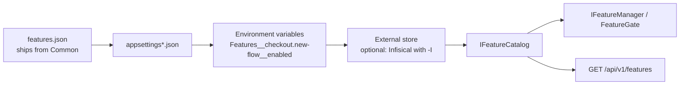

# Фича-флаги

Генерируются с `--FeatureFlags`, по умолчанию выключены. Флаг передаётся с `-M false` и каждому сервису,
который генерируется позже и читает фича-флаги.

Фича-флаг отвечает на один вопрос: *включено ли это поведение сейчас?* Ответ хранится как данные. Он
поставляется в одном файле, все сервисы читают его одинаково, его можно поменять в работающей системе, и
он несёт о себе достаточно, чтобы никому не пришлось спрашивать, кто его добавил и можно ли его убрать.

## Почему один файл

Фича-флаг в `appsettings.json` сервиса значит то, что под ним понимает этот сервис. Два сервиса тогда
расходятся в понимании одной фичи, а фича-флаг, который затрагивает оба, - миграцию, аварийный
выключатель, редизайн, видный в трёх местах, - приходится выставлять в трёх файлах, в правильном
порядке, и никто не должен забыть третий.

Поэтому фича-флаги живут в одном `features.json`, который поставляется из `Common`. Он едет вместе со
ссылкой на проект, попадает в выход сборки каждого сервиса, и все они его читают. У каждого фича-флага
одно значение, и меняется он в одном месте. Чтобы добавить фича-флаг, на который реагирует только UI,
код не нужен совсем: всё изменение - новая запись в файле.

Файл ещё и запасной вариант. Когда внешнее хранилище подключено и недоступно, платформа продолжает
работать на том, что сказано в файле, вместо того чтобы не стартовать или молча отвечать `false` на всё.

## Схема

```json
{
  "Features": {
    "checkout.new-flow": {
      "enabled": false,
      "effect": "enables",
      "environments": { "Development": true, "Staging": true },
      "tags": ["checkout", "migration"],
      "description": "Serve the rebuilt checkout instead of the original.",
      "owner": "payments",
      "expiresAt": "2026-12-31",
      "ticket": "ABC-123"
    }
  }
}
```

| Поле | Значение |
|---|---|
| `enabled` | Значение по умолчанию для любого окружения, которого нет в `environments`. |
| `effect` | `enables` или `disables` - значит ли *включено*, что фича работает или что она отключена. |
| `environments` | Переопределение по окружению, сверяется с текущим `IHostEnvironment.EnvironmentName` без учёта регистра. Благодаря ему один общий файл обслуживает все стенды. |
| `tags` | Свободные метки для группировки в интерфейсе управления: область, релиз, команда. |
| `description` | Что делает фича-флаг; пишется для того, кто найдёт его через год. |
| `owner` | К кому идти с вопросом. Фича-флаг без владельца никто не решается удалить. |
| `expiresAt` | Когда его не должно остаться. После этой даты фича-флаг отображается как **expired**: он продолжает работать, но долг виден, а не держится в чьей-то памяти. |
| `ticket` | Где записано решение. Намеренно простая строка: она переживёт смену трекера. |
| `pinned` | `true` делает `enabled` и `environments` из файла главнее всех остальных слоёв; см. [закрепление флага](#закрепление-флага). |

Ключи пишутся в нижнем kebab-case, с точками для подфич (`billing.invoice.recurring`), и сравниваются без
учёта регистра в обе стороны: `Checkout.New-Flow` и `checkout.new-flow` - один фича-флаг. Обратно всегда
возвращается написание из файла, поэтому интерфейс управления показывает каноническое имя, а не то, что
набрал вызывающий.

**Пишите фича-флаги так, чтобы *включено* значило, что фича работает.** Аварийный выключатель -
исключение, и `effect` нужен, чтобы он мог прямо это сказать, а не полагаться на то, что все помнят:
этот работает наоборот.

## Слои и какой из них победил

Значения разрешаются через `IConfiguration`, поэтому они разложены по слоям в таком порядке:



Более поздние слои побеждают, кроме случая [закреплённого](#закрепление-флага) флага. Каждое состояние
сообщает, **какой слой его определил**: `File`, `Store`, `EnvironmentVariable`, `Default` или `Pinned`.
Источник объясняет случай, который снаружи не виден: оператор выключает фича-флаг в файле, и ничего не
происходит, потому что выше стоит переменная окружения или хранилище.

Внешнее хранилище читается при старте и затем каждые `ReloadSeconds` (по умолчанию 300; 0 - только при
старте). Флаг, изменённый в нём, применяется в пределах этого времени без перезапуска: каталог читает
конфигурацию при каждом обращении. Пока хранилище недоступно, сервис может стартовать на
[снимке](secrets.ru.md#когда-хранилище-недоступно) того, что прочитал в последний раз.

<a id="pinning-a-flag"></a>
### Закрепление флага

Фича-флаг с `"pinned": true` в `features.json` берёт значение только из файла, поверх хранилища, его
снимка и переменных окружения. Это для одного фича-флага, который надо поменять сейчас: хранилище лежит
и сервис работает на снимке, или в хранилище стоит значение, которое здесь какое-то время не должно
действовать. Правится файл, фича-флаг закрепляется, больше ничего не трогается; хранилище держит своё
значение, пока закрепление не снимут.

- Закрепить может только файл: `pinned`, выставленный в хранилище или в переменной окружения,
  игнорируется, поэтому хранилище не может само себя зафиксировать.
- Закреплённый флаг сообщает источник `Pinned`, и каждый старт пишет в лог предупреждение с именами
  закреплённых флагов, чтобы закрепление, забытое после аварии, не продолжало тихо перекрывать
  хранилище.

Файл зарегистрирован с `reloadOnChange`, а каталог читает конфигурацию при каждом вызове и ничего не
кеширует, поэтому правка применяется к работающему сервису.

## Чтение флага

Два вызова, объявлять ничего не нужно. Файл подключается к конфигурации:

```csharp
builder.AddPlatformFeatures();   // IConfigurationBuilder, before every other layer
```

а механизм - к контейнеру:

```csharp
services.AddPlatformFeatureManagement(configuration);
```

`AddPlatformFeatures` привязывает файл к базовой директории приложения, а не к content root. Файл
поставляется в выходе сборки, а относительный путь разрешается от content root: под `dotnet run` это
директория проекта, в контейнере - директория приложения. С относительным путём в одном из двух случаев
файл молча не читался бы; с привязкой он находится в обоих.

После этого:

| Задача | Чем |
|---|---|
| Вычислить в коде | `IFeatureManager` из `Microsoft.FeatureManagement` поверх общего файла |
| Закрыть эндпоинт | `[FeatureGate(FeatureKeys.SomeFeature)]` - пока фича-флаг выключен, маршрут отвечает 404 и не попадает в документ Swagger |
| Прочитать взгляд платформы | `IFeatureCatalog` - значение плюс владелец, срок, теги и слой, который решил |
| Поменять значение | `IFeatureStore` или `PUT /api/v1/features/{key}` |

Вычисление остаётся за `Microsoft.FeatureManagement`: его вычисление, снимки и `[FeatureGate]` уже
написаны и протестированы. Шаблон добавляет схему, общий файл, сообщение об источнике и путь записи.

Ключи называются через константы:

```csharp
if (_features.IsEnabled(FeatureKeys.CheckoutNewFlow)) { … }
```

`FeatureKeys` ведётся вручную. Генерацию из JSON рассматривали и отказались: это source generator,
который придётся поддерживать вечно, ради экономии одной строки. Вместо этого тест проверяет, что каждая
константа называет фича-флаг, объявленный в файле. Фича-флагу, на который реагирует только UI, константа
не нужна вовсе.

## Изменение значения

`IFeatureStore` пишет в файл атомарно, через временный файл и перемещение, поэтому читатель никогда не
видит половину документа. Меняется только значение: описание, владелец, срок и тикет - это решения,
которые кто-то записал, и запись их сохраняет. Ключ, которого нет в файле, отклоняется с указанием имени,
чтобы файл продолжал описывать все фича-флаги системы.

По HTTP:

```
GET  /api/v1/features        → every flag, with value, source, expiry and metadata
PUT  /api/v1/features/{key}  → { "enabled": true, "environment": "Staging" }
```

`GET` анонимный. В списке нет секретов, а клиенту он нужен до того, как кто-то вошёл: экран входа должен
знать, какой из двух сценариев входа рисовать. `PUT` требует авторизации: он меняет поведение
платформы.

Проверка прав остаётся на сервере. Список фича-флагов решает, что клиент *рисует*, и никогда - что ему
*разрешено* делать: ни фича-флаг, ни устаревший кеш мобильного приложения не граница
безопасности.

## Удаление флага

Каждый фича-флаг когда-то заканчивается. `[BehindFeature("key")]` помечает код, который существует
*из-за* фича-флага: класс, метод, свойство, которые уходят вместе с ним:

```csharp
[BehindFeature(FeatureKeys.CheckoutNewFlow, RemoveWithFeature = true)]
internal sealed class RebuiltCheckoutHandler : ICheckoutHandler { … }
```

Удаление фича-флага всегда упирается в вопрос «что можно удалить?». С атрибутом ответ находится поиском,
а `expiresAt` поднимает вопрос в свою дату, и никому не надо об этом помнить.

## Тестирование

Фича-флаг задаётся там, где читается тест, а не за три метода от него в настройке конфигурации:

```csharp
[Test, WithFeature(FeatureKeys.CheckoutNewFlow)]
public async Task Should_serve_the_new_checkout() { … }

[Test, WithFeature(FeatureKeys.CheckoutNewFlow, false)]
public async Task Should_serve_the_old_one_when_off() { … }
```

`TestFeatureCatalog` подхватывает их, а ещё им можно управлять напрямую через `.With(key, enabled)`, когда
тест переключает фича-флаг посреди прогона. Состояние живёт в `AsyncLocal` отдельно для каждого теста и
очищается, когда тест заканчивается, поэтому при параллельном прогоне нет общего состояния для гонок и
следующему тесту ничего не остаётся в наследство.

Два проверочных теста проверяют, что каждая константа в `FeatureKeys` называет существующий фича-флаг и
каждый объявленный ключ сохраняет согласованный формат.

## Как подключать фронтенд

Фронтенду не нужно обращаться к бэкенду до того, как что-то нарисовать.

У фронтенда свой провайдер фича-флагов. У него есть собственные фича-флаги, до которых бэкенду нет дела:
эксперимент с вёрсткой, элемент интерфейса, то, что хочет попробовать дизайнер. Они живут в собственной
конфигурации фронтенда, в том же формате.

Бэкенд - ещё один источник, выше собственного источника фронтенда. `GET /api/v1/features` возвращает
взгляд платформы; провайдер накладывает его поверх локальных фича-флагов: перекрывает совпадающие и
добавляет недостающие. Тогда то, что в итоге станет общим хранилищем (менеджер секретов, база данных,
интерфейс управления), становится единственным источником истины и для бэкенда, и для фронтенда, и ни
одну сторону не надо пересобирать.

Во фронтенде:

- Загружать список при старте приложения и снова там, где это нужно: при смене маршрута, на экране
  администратора, после действия пользователя, которое от фича-флага зависит. Обращаться к бэкенду по
  мере того, как пользователь ходит по приложению, - обычное поведение веб-приложения.
- Неудачную загрузку считать «оставить локальные значения», никогда не «всё выключено». Сбой сети не
  должен выключать фичи у всех.
- Читать фича-флаги только через провайдер. Именно компонент, который лезет в конфигурацию напрямую,
  продолжает работать после удаления фича-флага.
- Рисовать по фича-флагу, но никогда не доверять ему права: сервер каждый раз решает сам, что разрешено.

Интерфейс управления тогда - небольшое приложение поверх тех же двух эндпоинтов: `GET` для списка, `PUT`
для изменения, с владельцем, сроком, тегами и источником уже в ответе.
