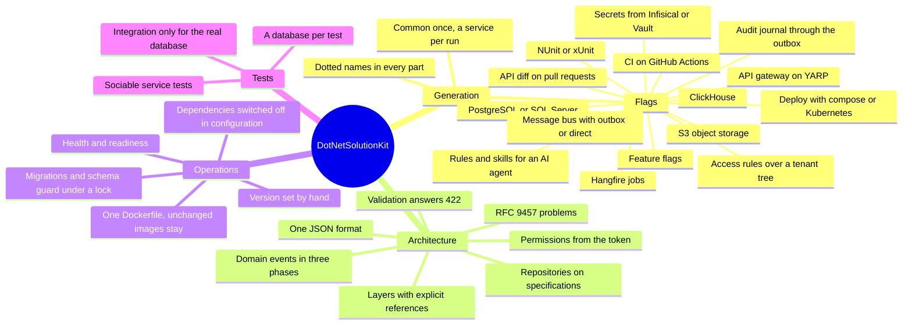

# What DotNetSolutionKit gives

A team receives a ready foundation for product development: the architecture, the infrastructure, the quality
checks and the rules for working with the system. Each solution is generated with exactly the capabilities it
requires.

DotNetSolutionKit is a `dotnet new` template for .NET 8 microservices. It generates shared Common libraries
and services in which layering, error handling, validation, persistence, domain events, background jobs,
testing and deployment are already in place. CI on GitHub Actions and everything else are enabled by flags.

## Flexibility

At generation time, a solution selects what it needs: PostgreSQL or SQL Server, Infisical or Vault, NUnit or
xUnit, the API gateway, the message bus, auditing. As the project grows, new capabilities are added alongside
the existing ones.

## Only business logic left to verify

The infrastructure is verified by the template's own tests and CI, and by runs of the generated solutions. The
team's reviews and tests focus on the rules of its domain.

## Principles

- The product is the generated solution, and that is what gets verified.
- At runtime, a service writes nothing to disk.
- With a secret store (Infisical or Vault), secrets reside only in the store and in the service's memory.
- The choice between libraries is made in one place.
- Every capability can be switched off cleanly, leaving nothing behind.

## AI agents

Skills describe the architecture's invariants to an AI agent and show how to write code without violating
them: [working with AI agents](working-with-ai-agents.md).

## Decisions rather than ready-made domains

Billing for network traffic, for an online store and for SaaS are different domain models. No single template
covers them.

The template will provide architectural decisions and the primitives they rely on: money in fixed-point
arithmetic, `Money` with its currency, an issued document as an immutable snapshot, policies for changing
payment details ([planned](https://github.com/sawking-tech/DotNetSolutionKit/issues/76)).

The team builds the model of its specific domain itself.

## Economics

For a team of five running eight services, the template saves 16-31 person-months of work in the first year.

At Dutch rates, that is about €100,000-225,000: a developer earns €5,000 gross a month, plus 25-45% in
employer costs on top ([Deel](https://www.deel.com/blog/employer-costs-for-an-employee-in-the-netherlands/)).

The original [calculation](https://sawking.tech/cv) was made at Moscow rates and comes to 5-10 million rubles.

The calculation covers labor only: the foundation is not built from scratch, and services are neither copied
nor maintained separately.

Additional savings:

- fewer infrastructure incidents;
- faster onboarding;
- faster launch of new services;
- updates and fixes are made once for all services;
- the time freed up can go to new projects.

The savings grow with how fully the project uses the template.

## Cost

The foundation works from day one.

Beyond the foundation, the team needs expertise in DDD, clean architecture and distributed systems: the
outbox, idempotency, eventual consistency, compensating actions.

A service stays simple until its domain needs these mechanisms.

The cost of the team must account for this expertise. Engineers who can build such systems command higher
rates.

## Risks

**1. A team may take on more than it can maintain.**
The template can bring such a team to a working system. If the team does not understand the architectural
decisions, support will have to be reinforced with specialists.

**2. Strong engineers become more expensive.**
A team may grow on the project, gain experience with distributed systems and leave with the tool. The MIT
license allows this.

**3. The baseline of expected expertise rises.**
As advanced architectural decisions become more accessible, the market starts expecting them from more
engineers. Quality becomes the norm.

The author believes the value for the business outweighs these risks.

## Quality assurance

The template's CI generates solutions in combinations that enable every flag at least once, builds them and
runs their tests. In the combinations with integration tests, the checks run against real servers and with the
workflows the solution ships with.

The generated solutions are published in
[DotNetSolutionKit.Samples](https://github.com/sawking-tech/DotNetSolutionKit.Samples). They are regenerated
after every release and every change to the working branch, and their CI runs on GitHub.
