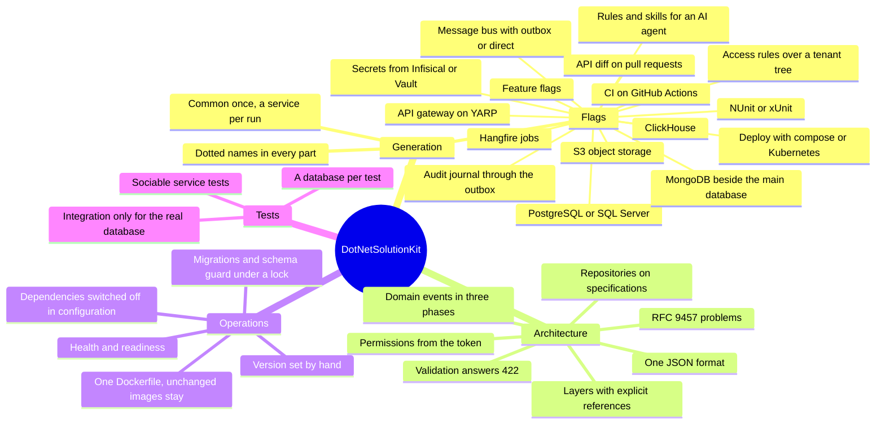

# Что даёт DotNetSolutionKit

Команда получает готовый фундамент для разработки продукта: архитектуру, инфраструктуру, проверки и правила
работы с системой. Решение генерируется под нужные ему возможности.

DotNetSolutionKit - шаблон `dotnet new` для микросервисов на .NET 8. Он генерирует общие библиотеки Common и
сервисы, где уже решены слои, ошибки, валидация, хранение, доменные события, фоновые задачи, тесты и деплой.
CI на GitHub Actions и остальное подключается флагами.

## Пластичность

При генерации решение берёт нужное: PostgreSQL или SQL Server, Infisical или Vault, NUnit или xUnit, шлюз,
шину, аудит. Когда проект растёт, новые возможности добавляются рядом с уже существующими.

## Проверяется только бизнес-логика

Инфраструктуру проверяют тесты и CI шаблона, а также прогоны сгенерированных решений. Ревью и тесты команды
заняты правилами домена.

## Принципы

- Продукт - сгенерированное решение, и именно оно проверяется.
- В рантайме сервис ничего не пишет на диск.
- С хранилищем секретов (Infisical или Vault) секреты живут только в нём и в памяти сервиса.
- Выбор между библиотеками держится в одном месте.
- Каждая возможность выключается без хвостов.

## Агент

Скиллы описывают агенту инварианты архитектуры и показывают, как писать код, не нарушая её: [работа с
ИИ-агентами](working-with-ai-agents.md).

## Решения вместо готовых доменов

Биллинг трафика, магазина и SaaS - разные предметные модели. Общего шаблона для них нет.

Шаблон даст архитектурные решения и примитивы, на которых они держатся: деньги в арифметике с фиксированной
точкой, `Money` с валютой, выставленный документ как неизменный снимок, правила смены платёжных реквизитов ([в
планах](https://github.com/sawking-tech/DotNetSolutionKit/issues/76)).

Модель конкретного домена команда строит сама.

## Экономика

Для команды из пяти человек, которая ведёт восемь сервисов, шаблон экономит за первый год 16-31 человеко-месяц
работы.

По голландским ставкам это примерно €100-225 тыс.: разработчик получает €5 000 gross в месяц, сверху
учитывается ещё 25-45% расходов работодателя
([Deel](https://www.deel.com/blog/employer-costs-for-an-employee-in-the-netherlands/)).

Исходный [расчёт](https://sawking.tech/cv) сделан по московским ставкам и даёт 5-10 млн ₽.

В расчёт входит только труд: каркас не пишется с нуля, сервисы не копируются и не поддерживаются по
отдельности.

Дополнительная экономия:

- меньше инфраструктурных инцидентов;
- быстрее онбординг;
- быстрее запуск новых сервисов;
- обновления и исправления делаются один раз для всех сервисов;
- освободившееся время можно направить на новые проекты.

Экономия растёт с тем, насколько полно проект использует шаблон.

## Цена

Каркас работает с первого дня.

Сверх каркаса нужны компетенции в DDD, чистой архитектуре и распределённых системах: outbox, идемпотентность,
конечная согласованность, компенсации.

Сервис остаётся простым, пока домену эти механизмы не нужны.

Стоимость команды должна учитывать эти компетенции. Инженеры, которые умеют строить такие системы, стоят
дороже.

## Риски

**1. Команда может взять больше, чем умеет поддерживать.**
Шаблон способен довести такую команду до работающей системы. Если архитектурные решения ей непонятны,
поддержку придётся усиливать специалистами.

**2. Сильные инженеры становятся дороже.**
Команда может вырасти на проекте, получить опыт распределённых систем и уйти вместе с инструментом. Лицензия
MIT это позволяет.

**3. Растёт минимальный уровень компетенций.**
Когда сложные архитектурные решения становятся доступнее, рынок начинает ожидать их от большего числа
инженеров. Качество становится нормой.

Автор считает, что польза для бизнеса перекрывает эти риски.

## Как это держится

CI шаблона генерирует решения в комбинациях, где каждый флаг включён хотя бы раз, собирает их и гоняет тесты.
В комбинациях с интеграционными тестами проверки идут на настоящих серверах и с поставляемыми workflow.

Сгенерированные решения лежат в
[DotNetSolutionKit.Samples](https://github.com/sawking-tech/DotNetSolutionKit.Samples), пересобираются после
каждого выпуска и изменения рабочей ветки, а их CI работает на GitHub.
