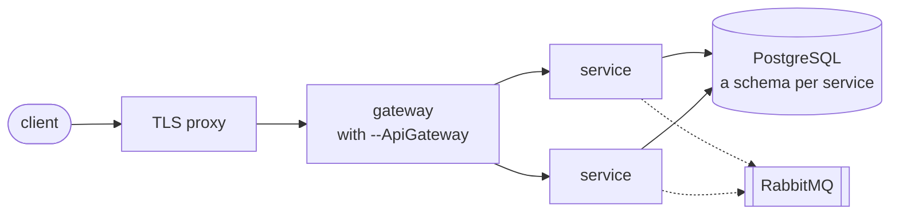
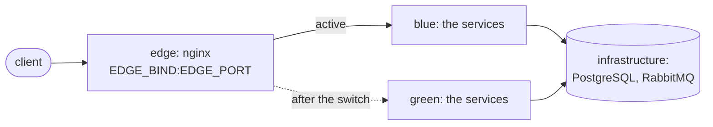

# Deployment

`--Deploy` chooses the deployment files a solution is generated with:

| Value | What is generated |
|---|---|
| `compose` (default) | `deploy/compose/`: the infrastructure, a script that starts it with every service, an example `.env`; and a `deploy/compose.yml` in each service's folder |
| `k8s` | `deploy/k8s/apply.sh`, and a `deploy/k8s.yaml` in each service's folder: a Deployment and a Service |
| `none` | nothing; the [Dockerfile](docker.md) only |

The two are exclusive: a team that runs Kubernetes gets no compose files to maintain, and the other way
round. With `compose` or `k8s`, `deploy/build-images.sh` builds an image per service.

`dotnet new` does not keep the executable bit, so on Linux and macOS run once:
`chmod +x deploy/*.sh deploy/*/*.sh`.

Each service keeps its deployment file in its own folder, so a service added later with `-M true` brings
its file along and nothing shared has to be edited. The scripts pick up every service's file.

What runs where, with a gateway; without one, the proxy talks to the services:



## Images

```bash
deploy/build-images.sh                                         # every service, as local/<product>-<service>:latest
deploy/build-images.sh Orders                                  # one service
REGISTRY=registry.example.com TAG=1.4.0 PUSH=1 deploy/build-images.sh
```

An image is named `<REGISTRY>/<product>-<service>:<TAG>`, both in lower case with underscores for dots
(`Retail.Shop` and `Sales.Orders` make `retail_shop-sales_orders`), so two solutions on one host do not
take each other's `orders` image. The script reads the name from the service's own deploy files: a
service generated before 2.1.3, named `<REGISTRY>/<service>`, keeps its name. `GIT_SHA` is the last commit that touched the service's inputs, so an
unchanged service gets the same image; see [Docker](docker.md).

## docker compose

```bash
cp deploy/compose/.env.example deploy/compose/.env    # fill in the passwords
deploy/build-images.sh
deploy/compose/compose.sh up -d --wait
```

`compose.sh` runs `docker compose` over every `deploy/compose/infra/*.yml` and every
`src/services/*/deploy/compose.yml`, with `deploy/compose/.env`; any `docker compose` command works through
it (`logs -f`, `down`, `ps`). Each part of the infrastructure is a file of its own - the database, RabbitMQ,
and what a flag brings (ClickHouse, MongoDB, MailHog, object storage) - so a part added later, the
template's or your own, is a new file in `infra/`, and `bluegreen.sh` reads the list of the infrastructure
from these files.

- PostgreSQL, and RabbitMQ when a service uses the bus, start first; a service starts once they report
  healthy.
- A service is healthy when its `/ready` answers, so `up --wait` returns when everything can serve, and
  whatever depends on a service waits for its database too.
- Each service is published on the host's loopback only, at the port it was generated with; a reverse
  proxy or a gateway in front publishes it further.
- All services share one database, each in its own schema; see [persistence](../architecture/persistence.md).

## Blue-green under compose

`compose.sh up` recreates the containers, and the service does not answer while they restart.
`bluegreen.sh` switches without a gap, on one host:

```bash
deploy/build-images.sh
deploy/compose/bluegreen.sh up          # start the other color, switch the edge to it, stop the old one
deploy/compose/bluegreen.sh rollback    # start the previous color again and switch back
deploy/compose/bluegreen.sh status
```



- A color is a compose project of the services, `<prefix>-blue` or `<prefix>-green`. PostgreSQL and
  RabbitMQ are a project of their own, shared by both colors; each color reaches them under their usual
  names on its own network.
- An nginx edge is the entry point. `up` starts the other color, waits until it is ready, points the
  edge at it and reloads nginx; requests in flight finish on the old color.
- The old color is then stopped, not removed: its jobs and consumers would otherwise go on running the
  old code. `rollback` starts it again and switches back; nothing is rebuilt. `KEEP_OLD=1` leaves it
  running for an instant rollback.
- `ENTRY` names the service the edge proxies to: the gateway, or the one service when there is only one.
- Both colors share the database while they overlap, so a migration has to leave the schema usable by
  the version still running: add first, remove in a later release.
- It needs docker compose 2.24 or later, for the `!reset` in the override it generates.

When something fails, the color that was serving keeps serving:

- A color that does not become ready is stopped, and its last log lines are printed; the edge and the
  recorded active color are not touched.
- When the edge does not answer `/ready` after the switch, it is pointed back at the previous color.
- `up` reconnects the infrastructure to both colors' networks: a changed setting or image recreates an
  infrastructure container, and without it the running color would lose its database.
- One run at a time: a second `up` or `rollback` while one runs refuses to start. A lock left by a run
  that was killed is taken over.

Checked under continuous requests to the edge: a deploy and a rollback, 321 requests, all answered 200.
Checked by breaking it: a color that cannot reach its database, an edge that does not answer after the
switch, two runs at once and a lock left behind.

## Kubernetes

```bash
REGISTRY=registry.example.com TAG=1.4.0 PUSH=1 deploy/build-images.sh
kubectl create secret generic orders \
  --from-literal=ConnectionStrings__DefaultConnection='Host=...;Database=...;Username=...;Password=...'
REGISTRY=registry.example.com TAG=1.4.0 deploy/k8s/apply.sh
```

`apply.sh` fills the registry and the tag into every `src/services/*/deploy/k8s.yaml` and applies it to the
current `kubectl` context; further arguments go to `kubectl apply` (`--namespace shop`).

- The Deployment runs two replicas and updates them one at a time: a new pod takes traffic once
  `/ready` answers, and an old one leaves only then (`maxUnavailable: 0`).
- Readiness is `/ready`, liveness is `/health`: a database outage takes a pod out of traffic without
  restarting it.
- Settings come from a Secret named after the service (`sales-orders` for `Sales.Orders`) as environment
  variables, the same keys as in `appsettings.json` with `__` for `:`. The Secret is optional, so a pod
  without it starts and reports what is missing.
- The database, the broker and the secret store are not in the manifests: a cluster usually has them
  managed, and their addresses go into the Secret.
- Replicas start together safely: migrations run under a lock, and so does the
  [schema guard](startup-checks.md).

## Checked

Both were run end to end on a generated solution: compose with two services, one generated later with
`-M true`, each answering `/ready` with its own commit; Kubernetes on k3s with four replicas of a service
with a dotted name on a fresh database, all ready without a restart.
