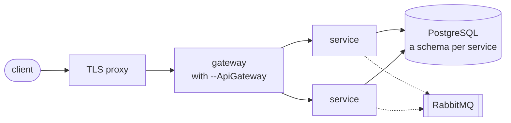
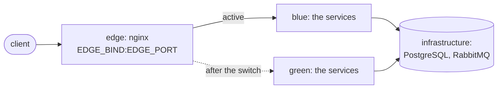

# Развёртывание

`--Deploy` выбирает, с какими файлами развёртывания генерируется решение:

| Значение | Что генерируется |
|---|---|
| `compose` (по умолчанию) | `deploy/compose/`: инфраструктура, скрипт, который запускает её вместе со всеми сервисами, пример `.env`; и `deploy/compose.yml` в папке каждого сервиса |
| `k8s` | `deploy/k8s/apply.sh` и `deploy/k8s.yaml` в папке каждого сервиса: Deployment и Service |
| `none` | ничего; только [Dockerfile](docker.md) |

Варианты взаимоисключающие: команде, которая работает с Kubernetes, не нужно поддерживать файлы compose,
и наоборот. С `compose` или `k8s` скрипт `deploy/build-images.sh` собирает по образу на сервис.

`dotnet new` не сохраняет бит исполнения, поэтому на Linux и macOS один раз выполните
`chmod +x deploy/*.sh deploy/*/*.sh`.

Каждый сервис хранит свой файл развёртывания в своей папке, поэтому сервис, добавленный позже с
`-M true`, приносит файл с собой, и править общие файлы не нужно. Скрипты подхватывают файлы всех
сервисов.

Что где работает при наличии шлюза; без него прокси обращается к сервисам напрямую:



## Образы

```bash
deploy/build-images.sh                                         # every service, as local/<product>-<service>:latest
deploy/build-images.sh Orders                                  # one service
REGISTRY=registry.example.com TAG=1.4.0 PUSH=1 deploy/build-images.sh
```

Образ называется `<REGISTRY>/<product>-<service>:<TAG>`, обе части в нижнем регистре, точки заменены
подчёркиваниями (`Retail.Shop` и `Sales.Orders` дают `retail_shop-sales_orders`), поэтому два решения на
одном хосте не перетирают друг другу образ `orders`. Скрипт берёт имя из собственных файлов развёртывания
сервиса: сервис, сгенерированный до 2.1.3 с именем `<REGISTRY>/<service>`, сохраняет своё имя. `GIT_SHA` -
последний коммит, который затронул входные файлы сервиса, поэтому неизменённый сервис получает тот же
образ; см. [Docker](docker.md).

## docker compose

```bash
cp deploy/compose/.env.example deploy/compose/.env    # fill in the passwords
deploy/build-images.sh
deploy/compose/compose.sh up -d --wait
```

`compose.sh` запускает `docker compose` над всеми `deploy/compose/infra/*.yml` и всеми
`src/services/*/deploy/compose.yml` с `deploy/compose/.env`; через него работает любая команда
`docker compose` (`logs -f`, `down`, `ps`). Каждая часть инфраструктуры - отдельный файл: база данных,
RabbitMQ и то, что приносит флаг (ClickHouse, MongoDB, MailHog, объектное хранилище). Часть, добавленная
позже, шаблоном или вами, - новый файл в `infra/`, а `bluegreen.sh` берёт список инфраструктуры из этих
файлов.

- Первыми стартуют PostgreSQL и, если какой-либо сервис использует шину, RabbitMQ; сервис стартует,
  когда они сообщат, что здоровы.
- Сервис здоров, когда отвечает его `/ready`, поэтому `up --wait` возвращает управление, когда всё готово
  обслуживать запросы, а всё, что зависит от сервиса, ждёт и его базу данных.
- Каждый сервис публикуется только на loopback хоста, на порту, с которым он сгенерирован; дальше его
  публикует обратный прокси или шлюз перед ним.
- Все сервисы используют одну базу данных, каждый в своей схеме; см.
  [хранение данных](../architecture/persistence.md).

## Blue-green под compose

`compose.sh up` пересоздаёт контейнеры, и пока они перезапускаются, сервис не отвечает.
`bluegreen.sh` переключает без перерыва на одном хосте:

```bash
deploy/build-images.sh
deploy/compose/bluegreen.sh up          # start the other color, switch the edge to it, stop the old one
deploy/compose/bluegreen.sh rollback    # start the previous color again and switch back
deploy/compose/bluegreen.sh status
```



- Цвет - это compose-проект из сервисов, `<prefix>-blue` или `<prefix>-green`. PostgreSQL и RabbitMQ -
  отдельный проект, общий для обоих цветов; каждый цвет обращается к ним по обычным именам в своей сети.
- Точка входа - edge на nginx. `up` запускает другой цвет, ждёт его готовности, направляет на него edge и
  перезагружает nginx; запросы, которые уже выполняются, завершаются на старом цвете.
- Затем старый цвет останавливается, но не удаляется: иначе его задачи и консьюмеры продолжали бы
  выполнять старый код. `rollback` снова запускает его и переключает обратно; ничего не пересобирается.
  `KEEP_OLD=1` оставляет старый цвет работать для мгновенного отката.
- `ENTRY` задаёт сервис, к которому проксирует edge: шлюз или единственный сервис, если он один.
- Пока цвета работают одновременно, база данных у них общая, поэтому миграция должна оставлять схему
  пригодной для версии, которая ещё работает: сначала добавить, удалить в следующем релизе.
- Нужен docker compose 2.24 или новее из-за `!reset` в генерируемом override.

Если что-то сломалось, цвет, который обслуживал запросы, продолжает их обслуживать:

- Цвет, который не стал готов, останавливается, и выводятся последние строки его лога; edge и записанный
  активный цвет не меняются.
- Если после переключения edge не отвечает на `/ready`, его направляют обратно на предыдущий цвет.
- `up` заново подключает инфраструктуру к сетям обоих цветов: изменённая настройка или образ пересоздаёт
  контейнер инфраструктуры, и без этого работающий цвет потерял бы базу данных.
- Одновременно идёт только один запуск: второй `up` или `rollback` во время работающего отказывается
  стартовать. Блокировку, оставленную убитым запуском, новый запуск забирает себе.

Проверено под непрерывными запросами к edge: развёртывание и откат, 321 запрос, на все ответ 200.
Проверено поломками: цвет без доступа к своей базе данных, edge, который не отвечает после переключения,
два запуска одновременно и оставленная блокировка.

## Kubernetes

```bash
REGISTRY=registry.example.com TAG=1.4.0 PUSH=1 deploy/build-images.sh
kubectl create secret generic orders \
  --from-literal=ConnectionStrings__DefaultConnection='Host=...;Database=...;Username=...;Password=...'
REGISTRY=registry.example.com TAG=1.4.0 deploy/k8s/apply.sh
```

`apply.sh` подставляет реестр и тег в каждый `src/services/*/deploy/k8s.yaml` и применяет его к текущему
контексту `kubectl`; остальные аргументы уходят в `kubectl apply` (`--namespace shop`).

- Deployment запускает две реплики и обновляет их по одной: новый под принимает трафик, когда отвечает
  `/ready`, и только после этого уходит старый (`maxUnavailable: 0`).
- Готовность - `/ready`, живость - `/health`: отказ базы данных выводит под из трафика без перезапуска.
- Настройки приходят переменными окружения из Secret с именем сервиса (`sales-orders` для
  `Sales.Orders`), ключи те же, что в `appsettings.json`, с `__` вместо `:`. Secret необязателен, поэтому
  под без него стартует и сообщает, чего не хватает.
- Базы данных, брокера и хранилища секретов в манифестах нет: в кластере они обычно управляемые, а их
  адреса кладутся в Secret.
- Реплики безопасно стартуют одновременно: миграции выполняются под блокировкой, как и
  [защита схемы](startup-checks.md).

## Проверено

Оба варианта прогнаны целиком на сгенерированном решении: compose с двумя сервисами, один из которых
сгенерирован позже с `-M true`, и каждый отвечает на `/ready` со своим коммитом; Kubernetes на k3s с
четырьмя репликами сервиса с именем через точку на чистой базе данных, все готовы без перезапуска.
