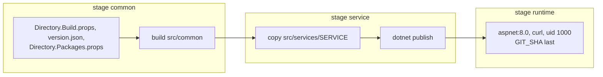

# Docker

One `Dockerfile` at the solution root builds every service:

```bash
docker build --provenance=false \
  --build-arg SERVICE=MyCompany.MyProduct.Orders \
  --build-arg GIT_SHA=$(git log -1 --format=%h -- src/common src/services/MyCompany.MyProduct.Orders '*.props' version.json) \
  -t orders .
```

## Only what changed is rebuilt



The first stage holds only `Common` and the build files, and builds `Common`. Each service adds its own
folder on top. So:

- a change in one service rebuilds that service alone; every other image keeps its layers and its digest;
- a change in `Common` rebuilds every service, with `Common` compiled once.

A deployment that compares digests restarts only the services whose image changed.

`GIT_SHA` is the last commit that changed the inputs of the service, not the last commit of the
repository: an unchanged service gets the same value, and so the same image. The service reports it as
`commit` in `/health`. `--provenance=false` leaves out the build attestation, which carries a timestamp
and would give every build a new digest.

## The image

- The ASP.NET runtime image, with `curl` for the health check.
- The service runs as an unprivileged user (uid 1000) on port 8080.
- `HEALTHCHECK` calls `/health`.
- The container's root filesystem is read-only under compose (`read_only`) and Kubernetes
  (`readOnlyRootFilesystem`), with `/tmp` in memory for what .NET and ASP.NET Core keep there. A running
  container is changed only by a new image, which passes review and CI: nobody edits `features.json` or
  the code in place. The service logs to stdout; a file log is set only in `appsettings.Local.json`, for a
  developer's machine.

`.dockerignore` keeps build output, IDE folders, logs, `.git` and every `appsettings.Secrets.json` out of
the build context.
