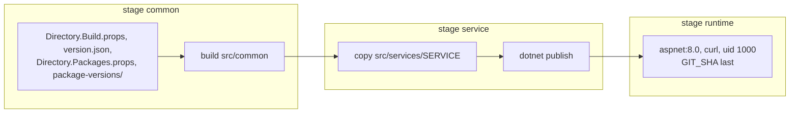

# Docker

Один `Dockerfile` в корне решения собирает все сервисы:

```bash
docker build --provenance=false \
  --build-arg SERVICE=MyCompany.MyProduct.Orders \
  --build-arg GIT_SHA=$(git log -1 --format=%h -- src/common src/services/MyCompany.MyProduct.Orders '*.props' version.json) \
  -t orders .
```

## Пересобирается только изменённое



Первая стадия содержит только `Common` и файлы сборки и собирает `Common`. Каждый сервис добавляет поверх
свою папку. Поэтому:

- изменение в одном сервисе пересобирает только этот сервис; остальные образы сохраняют свои слои и digest;
- изменение в `Common` пересобирает все сервисы, а `Common` компилируется один раз.

Развёртывание, которое сравнивает digest, перезапускает только сервисы с изменившимся образом.

`GIT_SHA` - последний коммит, который менял входные файлы сервиса, а не последний коммит репозитория:
у неизменённого сервиса значение то же, а значит, и образ тот же. Сервис отдаёт его как `commit` в
`/health`. `--provenance=false` убирает аттестацию сборки: в ней есть метка времени, и с ней каждая сборка
получала бы новый digest.

## Образ

- Образ рантайма ASP.NET с `curl` для проверки здоровья.
- Сервис работает от непривилегированного пользователя (uid 1000) на порту 8080.
- `HEALTHCHECK` вызывает `/health`.
- Корневая файловая система контейнера только для чтения в compose (`read_only`) и в Kubernetes
  (`readOnlyRootFilesystem`), `/tmp` в памяти - для того, что держат там .NET и ASP.NET Core. Работающий
  контейнер меняется только новым образом, который проходит ревью и CI: на месте `features.json` и код
  никто не правит. Сервис пишет лог в stdout; лог в файл задан только в `appsettings.Local.json`, для
  машины разработчика.

`.dockerignore` не пускает в контекст сборки результаты сборки, папки IDE, логи, `.git` и все
`appsettings.Secrets.json`.
