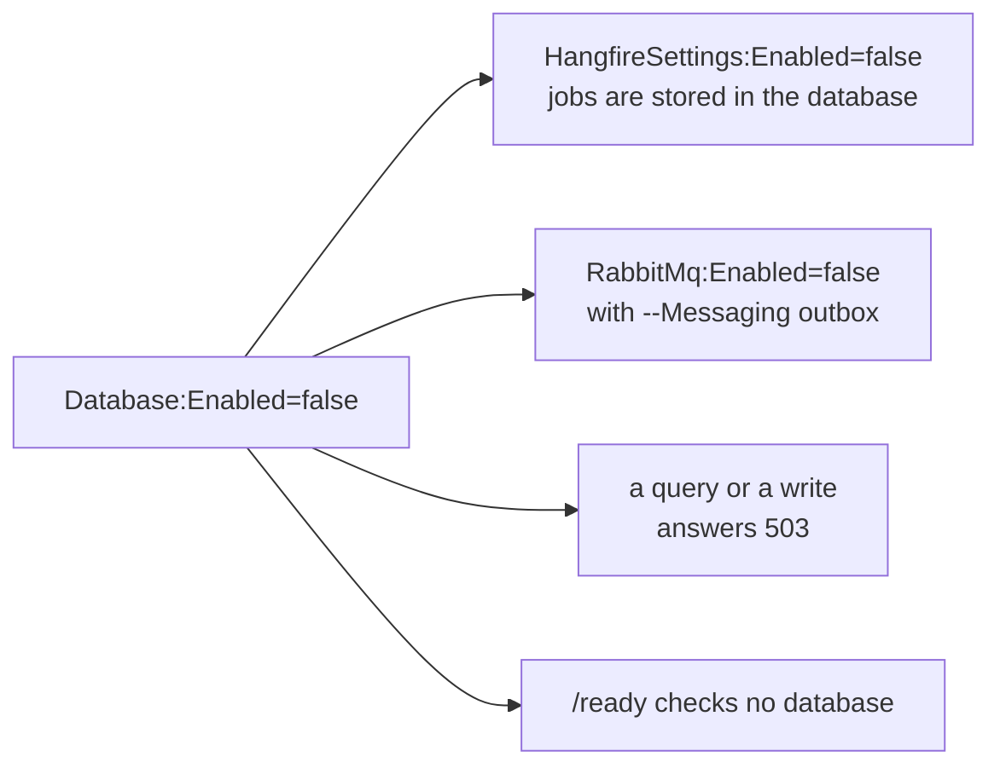

# Switching dependencies off

A generation flag such as `-H false` or `--Messaging none` leaves a part out of the code for good. A
switch in configuration leaves the code in place and stops using it on this run. A team can generate a
service with a database and a bus, run it without them while there is nothing to store or send, and
turn them on later with one setting, without regenerating anything.

| Setting | Default | Off means |
|---|---|---|
| `Database:Enabled` | `true` | no connection string, schema guard, migrations or readiness check; any query or write answers 503 |
| `HangfireSettings:Enabled` | `true` | no job server, no dashboard; the dashboard password is not required |
| `RabbitMq:Enabled` | `true` | a bus that drops what it is given, with a fatal line in the log at startup |
| `Infisical:Enabled` | `true` | nothing is read from the secret store; values come from the files and the environment |
| `ClickHouse:Enabled` | `true` | a connection answers 503, no readiness check, no connection string required |
| `MongoDB:Enabled` | `true` | the database answers 503, no readiness check, no connection string or database required |
| `S3:Enabled` | `true` | object storage keeps nothing: writes are ignored, reads return empty |

What a switched-off dependency registers: no services, no settings to validate, no check in `/ready`. The
service logs one line at startup naming what is off:

```text
[WRN] Running without: Database:Enabled=false, HangfireSettings:Enabled=false, RabbitMq:Enabled=false
```

## What goes off with the database



The job server stores its jobs in the database, so it goes off with it. So does a bus that delivers
through the outbox (`--Messaging outbox`), because the outbox is a table. A bus that sends straight to the
broker (`--Messaging direct`) stays on.

The service's `DbContext` stays registered while the database is off, so repositories and handlers that
depend on it are still built and the start does not fail. Opening a connection fails before it reaches
the network, and the client gets a 503 problem naming `Database:Enabled=false`.

## Why on by default

A deployed service that started without its database because a line of configuration was missing would
fail later, on the first request, far from the cause. Starting with everything on makes a missing setting
stop the start, and the message names the switch that turns the dependency off if that was the intent:

```text
Connection string 'DefaultConnection' not found. Set ConnectionStrings__DefaultConnection, or run without
a database: Database:Enabled=false.
```

## The internal API key

`InternalApi:ApiKey` is the one other setting a new service used to need before it would start. It is
optional: without a key, every call that presents an API key is refused, so the internal
API is closed until a key is set. A key that is set must have at least 16 characters.
