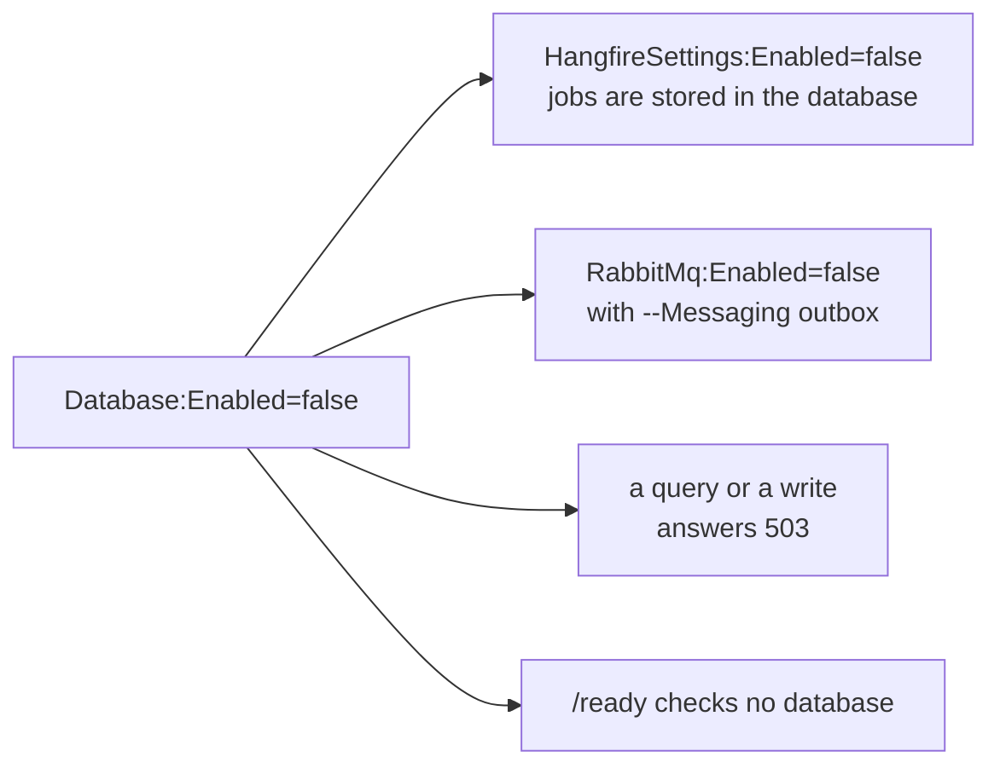

# Отключение зависимостей

Флаг генерации вроде `-H false` или `--Messaging none` навсегда убирает часть из кода. Переключатель в
конфигурации оставляет код на месте и перестаёт его использовать в этом запуске. Команда может
сгенерировать сервис с базой данных и шиной, запускать его без них, пока нечего хранить и отправлять, и
потом включить их одной настройкой, ничего не генерируя заново.

| Настройка | По умолчанию | Выключено - значит |
|---|---|---|
| `Database:Enabled` | `true` | нет строки подключения, защиты схемы, миграций и проверки готовности; любой запрос или запись отвечает 503 |
| `HangfireSettings:Enabled` | `true` | нет сервера задач и дашборда; пароль дашборда не требуется |
| `RabbitMq:Enabled` | `true` | шина отбрасывает всё, что ей передают, и при старте пишет в лог строку уровня fatal |
| `Infisical:Enabled` | `true` | из хранилища секретов ничего не читается; значения берутся из файлов и окружения |
| `ClickHouse:Enabled` | `true` | подключение отвечает 503, проверки готовности нет, строка подключения не требуется |
| `S3:Enabled` | `true` | объектное хранилище ничего не хранит: записи игнорируются, чтение возвращает пустое |

Отключённая зависимость не регистрирует ни сервисов, ни настроек для валидации, ни проверки в `/ready`.
При старте сервис пишет одну строку со списком отключённого:

```text
[WRN] Running without: Database:Enabled=false, HangfireSettings:Enabled=false, RabbitMq:Enabled=false
```

## Что отключается вместе с базой данных



Сервер задач хранит задачи в базе данных, поэтому отключается вместе с ней. То же с шиной, которая
доставляет через outbox (`--Messaging outbox`): outbox - это таблица. Шина, которая отправляет прямо в
брокер (`--Messaging direct`), остаётся включённой.

`DbContext` сервиса остаётся зарегистрированным при отключённой базе, поэтому зависящие от него
репозитории и обработчики по-прежнему создаются, и старт не падает. Открытие соединения падает ещё до
обращения к сети, а клиент получает problem 503 с указанием `Database:Enabled=false`.

## Почему по умолчанию всё включено

Развёрнутый сервис, который стартовал без базы данных из-за пропущенной строки конфигурации, упал бы
позже, на первом запросе, далеко от причины. Когда всё включено, пропущенная настройка останавливает
старт, а сообщение называет переключатель, который отключает зависимость, если так и задумано:

```text
Connection string 'DefaultConnection' not found. Set ConnectionStrings__DefaultConnection, or run without
a database: Database:Enabled=false.
```

## Внутренний API-ключ

`InternalApi:ApiKey` - единственная, кроме перечисленных, настройка, без которой новый сервис раньше не
стартовал. Теперь она необязательна: без ключа отклоняется каждый вызов с API-ключом, то есть внутренний
API закрыт, пока ключ не задан. Заданный ключ должен быть не короче 16 символов.
