# Roadmap

Releases done, the step in progress and the planned steps, in order. The axis counts steps, not dates; a longer bar is a larger step, and bars side by side can go in parallel.

```mermaid
gantt
    dateFormat X
    axisFormat %s
    tickInterval 1second

    section Done
    v1.0 the template before 2026                         :done, s1, 0, 3000ms
    v2.0 layered services, shared host, flags             :done, s2, after s1, 3000ms
    v2.1 deployment, API gateway, CI, correlation         :done, s3, after s2, 2000ms
    v2.2 idempotent commands                              :done, s4, after s3, 500ms
    v2.3 surviving a secret store outage                  :done, s5, after s4, 500ms
    v2.4 tokens in cookies, CSRF                          :done, s6, after s5, 500ms
    v2.5 audit journal                                    :done, s7, after s6, 1000ms
    v2.6 NUnit or xUnit                                   :done, s8, after s7, 1000ms
    v2.7 site, samples, nuget.org, major check, gateway (#5), Vault, settings reloaded, SQL Server :done, s9, after s8, 4000ms

    section Now
    shipped workflows run in the template's CI; work in dev, master releases :done, s10, after s8, 1000ms
    gateway Swagger like a product's, open bugs closed :done, s11, after s10, 2000ms
    rules and skills for an AI agent, Claude Code or OpenCode (--Agent) :done, s12, after s11, 1000ms
    a marketplace on the template, end to end; what it finds is fixed :active, s13, after s12, 2000ms
    a solution's coverage on demand, a report per service (#65) :done, s14, after s9, 1000ms
    a page on what the template gives - principles, economics, price :done, s16, after s14, 500ms
    the map of what a solution gets knows every flag of 2.7 :done, s17, after s16, 300ms
    tests carry one set of attributes on NUnit and xUnit, no #if :done, s18, after s17, 500ms
    the database is chosen in one place, DatabaseProvider :done, s19, after s18, 500ms
    Samples full-alt - SQL Server, xUnit, Vault, Kubernetes, audit :done, s20, after s19, 300ms
    containers run on a read-only root filesystem :done, s21, after s20, 300ms
    MongoDB by flag, beside the main database :done, s22, after s21, 1000ms
    notifications by email, SMTP or Graph, with a sandbox :done, s23, after s22, 800ms
    another service asks for an email by a bus command :done, s24, after s23, 300ms
    the site's release notes are in its HTML, for readers without JavaScript (#61) :done, s25, after s24, 500ms
    a service generated into a solution adds itself to All.sln, on any OS; no script to run :done, s26, after s25, 500ms
    dotskit new - a service or a flag added to a solution, the team's changes kept by a three-way merge :done, s27, after s26, 2000ms
    email and MongoDB in projects of their own - a service carries only its flags' packages (#98) :done, s28, after s25, 800ms
    dotskit init - a manifest for a solution made without the tool, checked against it (#99) :done, s29, after s27, 1500ms
    dotskit upgrade - to the tool's version, one major at a time, the team's changes kept (#100) :done, s30, after s29, 3000ms

    section Next
    2.9 - dotskit upgrade adds the project references and using lines of types the template moved (#117) :s32, after s30, 1500ms
    3.0 on .NET 8 - Common split by capability, a 2.x solution upgraded by dotskit :s15, after s32, 3000ms
    4.0 on .NET 10; 3.x stays on .NET 8 until 10 November 2026 :s31, after s15, 3000ms
```

What each release brought: [version.json](https://github.com/sawking-tech/DotNetSolutionKit/blob/master/version.json).
Work goes into `dev`, and a release reaches `master` about once a week ([CONTRIBUTING](https://github.com/sawking-tech/DotNetSolutionKit/blob/master/CONTRIBUTING.md)).
Everything in Now goes into 2.8, on .NET 8, and 2.8 is released when `dotskit` is whole: it adds services
and flags to a solution, describes a solution made without it, and upgrades a solution to its version,
merging the template's changes with the team's. 3.0 stays on .NET 8 and splits `Common` into a project per capability, so a service carries only the
packages it uses; a 2.x solution is upgraded to it by `dotskit`, which since 2.9 adds the project references and `using` lines of the types the template moved. 4.0
moves to .NET 10. Support for .NET 8 ends on 10 November 2026: 3.0 and 4.0 are out before it, and 3.x then
takes fixes only.

| Version | What changes for a solution |
|---|---|
| 2.8 | `dotskit` keeps a solution up with the template: `dotskit new` adds a service or a flag and keeps the team's changes, `dotskit init` describes a solution made without it, `dotskit upgrade` brings a solution to its version; a service added with the template alone puts itself into `All.sln`, without a script; MongoDB and email by flag, each a project of its own in `src/capabilities`; containers on a read-only filesystem; the test servers start with one command, the same locally as in CI; coverage on demand; `--Solution` in place of `-M false` |
| 2.9 | `dotskit upgrade` builds the solution after the merge and adds the project references and `using` lines a moved type needs, from an index of where each type of the template lives; what is left is listed by project (#117) |
| 3.0 | The shared code is laid out by what it is. `src/framework` - the systems the template brings as a way of working, always there and used as they are: the three-phase domain events ([ADR-001](adr/001-three-phase-domain-events.md)) and the testing system ([ADR-005](adr/005-testing-a-service.md)). `src/capabilities` - what a flag turns on, a project per flag, configured and not changed: feature flags, MongoDB, email, ClickHouse, object storage, the audit journal; a flag that is off leaves its project out whole. `src/common` - what the services of the product share and the team changes to its needs: the contracts, the database context base, the web pipeline. A namespace names its kind (`NamespaceRoot.ProductName.Capabilities.Mongo`). The secret store becomes the configuration store. `-M` is gone (`--Solution` since 2.8), flags are written in lower case (`--api-gateway`), the package is `SawKing.DotsKit.Templates`. `dotskit upgrade` takes a solution of the last 2.x there, and its repair of 2.9 adds the references and `using` lines of the types that moved |
| 4.0 | .NET 10 |

## Reducing lock-in

The defaults are the author's preferences; a team with its own standard should be able to replace them.

| Technology | Where the template depends on it now |
|---|---|
| PostgreSQL | none: `--Database mssql` generates the solution on SQL Server, each of these behind the same seam, see [persistence](architecture/persistence.md#sql-server) |
| Infisical | none: `--Vault` reads the same way from HashiCorp Vault, through the same `ISecretStore` port, see [secrets](features/secrets.md#hashicorp-vault) |
| GitHub CI | only the generated workflow; the checks are scripts any CI can call |
