# Roadmap

Releases done, the step in progress and the planned steps, in order. The axis counts steps, not dates; a longer bar is a larger step, and bars side by side can go in parallel.

```mermaid
gantt
    dateFormat X
    axisFormat %s
    tickInterval 1second

    section Done
    v1.0 the template before 2026                         :done, s1, 0, 3000ms
    v2.0 layered services, shared host, flags             :done, s2, after s1, 3000ms
    v2.1 deployment, API gateway, CI, correlation         :done, s3, after s2, 2000ms
    v2.2 idempotent commands                              :done, s4, after s3, 500ms
    v2.3 surviving a secret store outage                  :done, s5, after s4, 500ms
    v2.4 tokens in cookies, CSRF                          :done, s6, after s5, 500ms
    v2.5 audit journal                                    :done, s7, after s6, 1000ms
    v2.6 NUnit or xUnit                                   :done, s8, after s7, 1000ms

    v2.7 site, samples, nuget.org, major check, gateway (#5), Vault, settings reloaded, SQL Server :done, s9, after s8, 4000ms

    section Now
    3.0 on .NET 10 in master, with the path from 2.x; 2.x stays on .NET 8 :active, s15, after s9, 3000ms
```

What each release brought: [version.json](https://github.com/sawking-tech/DotNetSolutionKit/blob/master/version.json).
Version 2 stays on .NET 8 in the `2.x` branch and takes fixes only, until support for .NET 8 ends on
10 November 2026. How a solution moves from 2.x to 3.0: [upgrading](getting-started/upgrading.md#from-v2-to-v3).

## Reducing lock-in

The defaults are the author's preferences; a team with its own standard should be able to replace them.

| Technology | Where the template depends on it now |
|---|---|
| PostgreSQL | none: `--Database mssql` generates the solution on SQL Server, each of these behind the same seam, see [persistence](architecture/persistence.md#sql-server) |
| Infisical | none: `--Vault` reads the same way from HashiCorp Vault, through the same `ISecretStore` port, see [secrets](features/secrets.md#hashicorp-vault) |
| GitHub CI | only the generated workflow; the checks are scripts any CI can call |
