# Roadmap

Releases done, the step in progress and the planned steps, in order. The axis counts steps, not dates; a longer bar is a larger step, and bars side by side can go in parallel.

```mermaid
gantt
    dateFormat X
    axisFormat %s
    tickInterval 1second

    section Done
    v1.0 the template before 2026                         :done, s1, 0, 3000ms
    v2.0 layered services, shared host, flags             :done, s2, after s1, 3000ms
    v2.1 deployment, API gateway, CI, correlation         :done, s3, after s2, 2000ms
    v2.2 idempotent commands                              :done, s4, after s3, 500ms
    v2.3 surviving a secret store outage                  :done, s5, after s4, 500ms
    v2.4 tokens in cookies, CSRF                          :done, s6, after s5, 500ms
    v2.5 audit journal                                    :done, s7, after s6, 1000ms
    v2.6 NUnit or xUnit                                   :done, s8, after s7, 1000ms

    section Now
    v2.7 site, samples, nuget.org, major check, gateway Swagger and permissions (#5) :active, s9, after s8, 2000ms

    section Next
    Upgrade path between majors                           :s11, after s9, 1000ms
    HashiCorp Vault as a second secret store              :s12, after s9, 1500ms
    Settings and secrets reloaded without a redeploy      :s13, after s12, 1000ms
    SQL Server as a second database                       :s14, after s9, 3000ms
    3.0 on .NET 10 in master, 2.x stays on .NET 8         :s15, after s11 s13 s14, 2500ms
```

What each release brought: [version.json](https://github.com/sawking-tech/DotNetSolutionKit/blob/master/version.json).
Everything in Next goes into 2.x, on .NET 8, before 3.0: support for .NET 8 ends on 10 November 2026, and from 3.0 on
the 2.x branch takes fixes only.

## Reducing lock-in

The defaults are the author's preferences; a team with its own standard should be able to replace them.

| Technology | Where the template depends on it now |
|---|---|
| PostgreSQL | the schema guard, the migration lock, unique-violation mapping, `ILIKE` search, Hangfire's storage |
| Infisical | only the options: secrets are read through the `ISecretStore` port, see [secrets](features/secrets.md#why-infisical) |
| GitHub CI | only the generated workflow; the checks are scripts any CI can call |
