# Дорожная карта

Выпущенные релизы, текущий шаг и запланированные шаги по порядку. Ось считает шаги, а не даты: чем длиннее полоса, тем больше шаг. Полосы, стоящие рядом, можно делать параллельно.

```mermaid
gantt
    dateFormat X
    axisFormat %s
    tickInterval 1second

    section Done
    v1.0 the template before 2026                         :done, s1, 0, 3000ms
    v2.0 layered services, shared host, flags             :done, s2, after s1, 3000ms
    v2.1 deployment, API gateway, CI, correlation         :done, s3, after s2, 2000ms
    v2.2 idempotent commands                              :done, s4, after s3, 500ms
    v2.3 surviving a secret store outage                  :done, s5, after s4, 500ms
    v2.4 tokens in cookies, CSRF                          :done, s6, after s5, 500ms
    v2.5 audit journal                                    :done, s7, after s6, 1000ms
    v2.6 NUnit or xUnit                                   :done, s8, after s7, 1000ms

    section Now
    Site and documentation on GitHub Pages                :active, s9, after s8, 1000ms

    section Next
    Samples rebuilt from each release (#4)                :s10, after s9, 500ms
    Package on nuget.org                                  :s11, after s9, 500ms
    Template version mark, major checked at build         :s12, after s10 s11, 1000ms
    Services' Swagger and permissions via the gateway (#5) :s13, after s10 s11, 1500ms
    Upgrade path between majors                           :s14, after s12, 1500ms
    A choice of secret store                              :s15, after s13, 1500ms
    A choice of database                                  :s16, after s13, 3000ms
    .NET 9 and later, in a branch of its own              :s17, after s14 s15 s16, 2500ms
```

Что принёс каждый релиз: [version.json](https://github.com/sawking-tech/DotNetSolutionKit/blob/master/version.json).
Задачи: [#4](https://github.com/sawking-tech/DotNetSolutionKit/issues/4) - примеры, [#5](https://github.com/sawking-tech/DotNetSolutionKit/issues/5) - шлюз.

## Меньше привязки к технологиям

Технологии по умолчанию выбраны по вкусу автора. Команда со своим стандартом должна иметь возможность их заменить.

| Технология | Где шаблон от неё зависит сейчас |
|---|---|
| PostgreSQL | защита схемы, блокировка миграций, разбор нарушения уникальности, поиск через `ILIKE`, хранилище Hangfire |
| Infisical | только настройки: секреты читаются через порт `ISecretStore`, см. [секреты](features/secrets.ru.md#почему-infisical) |
| GitHub CI | только сгенерированный workflow; проверки - это скрипты, которые вызовет любой CI |
