# Дорожная карта

Выпущенные релизы, текущий шаг и запланированные шаги по порядку. Ось считает шаги, а не даты: чем длиннее полоса, тем больше шаг. Полосы, стоящие рядом, можно делать параллельно.

```mermaid
gantt
    dateFormat X
    axisFormat %s
    tickInterval 1second

    section Done
    v1.0 the template before 2026                         :done, s1, 0, 3000ms
    v2.0 layered services, shared host, flags             :done, s2, after s1, 3000ms
    v2.1 deployment, API gateway, CI, correlation         :done, s3, after s2, 2000ms
    v2.2 idempotent commands                              :done, s4, after s3, 500ms
    v2.3 surviving a secret store outage                  :done, s5, after s4, 500ms
    v2.4 tokens in cookies, CSRF                          :done, s6, after s5, 500ms
    v2.5 audit journal                                    :done, s7, after s6, 1000ms
    v2.6 NUnit or xUnit                                   :done, s8, after s7, 1000ms
    v2.7 site, samples, nuget.org, major check, gateway (#5), Vault, settings reloaded, SQL Server :done, s9, after s8, 4000ms

    section Now
    shipped workflows run in the template's CI; work in dev, master releases :done, s10, after s8, 1000ms
    gateway Swagger like a product's, open bugs closed :done, s11, after s10, 2000ms
    rules and skills for an AI agent, Claude Code or OpenCode (--Agent) :done, s12, after s11, 1000ms
    a marketplace on the template, end to end; what it finds is fixed :active, s13, after s12, 2000ms
    a solution's coverage on demand, a report per service (#65) :done, s14, after s9, 1000ms
    a page on what the template gives - principles, economics, price :done, s16, after s14, 500ms
    the map of what a solution gets knows every flag of 2.7 :done, s17, after s16, 300ms
    tests carry one set of attributes on NUnit and xUnit, no #if :done, s18, after s17, 500ms
    the database is chosen in one place, DatabaseProvider :done, s19, after s18, 500ms
    Samples full-alt - SQL Server, xUnit, Vault, Kubernetes, audit :done, s20, after s19, 300ms
    containers run on a read-only root filesystem :done, s21, after s20, 300ms
    MongoDB by flag, beside the main database :done, s22, after s21, 1000ms
    notifications by email, SMTP or Graph, with a sandbox :done, s23, after s22, 800ms
    another service asks for an email by a bus command :done, s24, after s23, 300ms
    the site's release notes are in its HTML, for readers without JavaScript (#61) :done, s25, after s24, 500ms
    a service generated into a solution adds itself to All.sln, on any OS; no script to run :done, s26, after s25, 500ms
    dotskit new - a service or a flag added to a solution, the team's changes kept by a three-way merge :done, s27, after s26, 2000ms
    email and MongoDB in projects of their own - a service carries only its flags' packages (#98) :done, s28, after s25, 800ms
    dotskit init - a manifest for a solution made without the tool, checked against it (#99) :done, s29, after s27, 1500ms
    dotskit upgrade - to the tool's version, one major at a time, the team's changes kept (#100) :done, s30, after s29, 3000ms

    section Next
    2.9 - dotskit upgrade adds the project references and using lines of types the template moved (#117) :s32, after s30, 1500ms
    3.0 on .NET 8 - Common split by capability, a 2.x solution upgraded by dotskit :s15, after s32, 3000ms
    4.0 on .NET 10; 3.x stays on .NET 8 until 10 November 2026 :s31, after s15, 3000ms
```

Что принёс каждый релиз: [version.json](https://github.com/sawking-tech/DotNetSolutionKit/blob/master/version.json).
Работа идёт в `dev`, а релиз попадает в `master` примерно раз в неделю ([CONTRIBUTING](https://github.com/sawking-tech/DotNetSolutionKit/blob/master/CONTRIBUTING.md)).
Всё из Now входит в 2.8, на .NET 8, и 2.8 выходит, когда `dotskit` готов целиком: добавляет в решение
сервисы и флаги, описывает решение, сделанное без него, и обновляет решение до своей версии, сливая
изменения шаблона с правками команды. 3.0 остаётся на .NET 8
и делит `Common` на проекты по возможностям, чтобы сервис нёс только те пакеты, которыми пользуется; решение
2.x обновляется на неё через `dotskit`, который с 2.9 добавляет ссылки на проекты и строки `using` для типов, перенесённых шаблоном. 4.0 переходит на .NET 10.
Поддержка .NET 8 заканчивается 10 ноября 2026 года: 3.0 и 4.0 выходят до этой даты, после неё 3.x получает
только исправления.

| Версия | Что меняется для решения |
|---|---|
| 2.8 | `dotskit` держит решение в ногу с шаблоном: `dotskit new` добавляет сервис или флаг и сохраняет правки команды, `dotskit init` описывает решение, сделанное без него, `dotskit upgrade` обновляет решение до своей версии; сервис, добавленный одним шаблоном, сам встаёт в `All.sln`, без скрипта; MongoDB и почта по флагу, у каждой свой проект в `src/capabilities`; контейнеры с файловой системой только для чтения; тестовые серверы запускаются одной командой, локально так же, как в CI; покрытие по запросу; `--Solution` вместо `-M false` |
| 2.9 | `dotskit upgrade` собирает решение после слияния и добавляет ссылки на проекты и строки `using`, которые нужны перенесённому типу, по индексу того, где лежит каждый тип шаблона; что осталось, перечисляется по проектам (#117) |
| 3.0 | Общий код раскладывается по тому, что он такое. `src/framework` - системы, которые шаблон приносит как способ работы, есть всегда и используются как есть: трёхфазные доменные события ([ADR-001](adr/001-three-phase-domain-events.ru.md)) и система тестирования ([ADR-005](adr/005-testing-a-service.ru.md)). `src/capabilities` - то, что включает флаг, проект на флаг, настраивается, но не правится: фичефлаги, MongoDB, почта, ClickHouse, объектное хранилище, журнал аудита; выключенный флаг убирает свой проект целиком. `src/common` - общее для сервисов продукта, которое команда меняет под себя: контракты, базовый контекст базы, веб-конвейер. Пространство имён называет вид (`NamespaceRoot.ProductName.Capabilities.Mongo`). Хранилище секретов становится хранилищем конфигурации. `-M` уходит (`--Solution` есть с 2.8), флаги пишутся в нижнем регистре (`--api-gateway`), пакет называется `SawKing.DotsKit.Templates`. На неё решение последнего 2.x переводит `dotskit upgrade`, и его починка из 2.9 добавляет ссылки и строки `using` для переехавших типов |
| 4.0 | .NET 10 |

## Меньше привязки к технологиям

Технологии по умолчанию выбраны по вкусу автора. Команда со своим стандартом должна иметь возможность их заменить.

| Технология | Где шаблон от неё зависит сейчас |
|---|---|
| PostgreSQL | нет: `--Database mssql` генерирует решение на SQL Server, каждая из этих частей за тем же швом, см. [хранение](architecture/persistence.ru.md#sql-server) |
| Infisical | нет: `--Vault` читает так же из HashiCorp Vault, через тот же порт `ISecretStore`, см. [секреты](features/secrets.ru.md#hashicorp-vault) |
| GitHub CI | только сгенерированный workflow; проверки - это скрипты, которые вызовет любой CI |
