# Дорожная карта

Выпущенные релизы, текущий шаг и запланированные шаги по порядку. Ось считает шаги, а не даты: чем длиннее полоса, тем больше шаг. Полосы, стоящие рядом, можно делать параллельно.

```mermaid
gantt
    dateFormat X
    axisFormat %s
    tickInterval 1second

    section Done
    v1.0 the template before 2026                         :done, s1, 0, 3000ms
    v2.0 layered services, shared host, flags             :done, s2, after s1, 3000ms
    v2.1 deployment, API gateway, CI, correlation         :done, s3, after s2, 2000ms
    v2.2 idempotent commands                              :done, s4, after s3, 500ms
    v2.3 surviving a secret store outage                  :done, s5, after s4, 500ms
    v2.4 tokens in cookies, CSRF                          :done, s6, after s5, 500ms
    v2.5 audit journal                                    :done, s7, after s6, 1000ms
    v2.6 NUnit or xUnit                                   :done, s8, after s7, 1000ms

    section Now
    v2.7 site, samples, nuget.org, major check, gateway (#5), Vault, settings reloaded, SQL Server :active, s9, after s8, 4000ms
    shipped workflows run in the template's CI; work in dev, master releases :done, s10, after s8, 1000ms
    gateway Swagger like a product's, open bugs closed :done, s11, after s10, 2000ms

    section Next
    3.0 on .NET 10 in master, with the path from 2.x; 2.x stays on .NET 8 :s15, after s9, 3000ms
```

Что принёс каждый релиз: [version.json](https://github.com/sawking-tech/DotNetSolutionKit/blob/master/version.json).
Работа идёт в `dev`, а релиз попадает в `master` примерно раз в неделю ([CONTRIBUTING](https://github.com/sawking-tech/DotNetSolutionKit/blob/master/CONTRIBUTING.md)).
Всё из Now входит в 2.x, на .NET 8, до 3.0, которая запланирована на следующую неделю: поддержка .NET 8
заканчивается 10 ноября 2026 года, и с 3.0 ветка 2.x получает только исправления.

## Меньше привязки к технологиям

Технологии по умолчанию выбраны по вкусу автора. Команда со своим стандартом должна иметь возможность их заменить.

| Технология | Где шаблон от неё зависит сейчас |
|---|---|
| PostgreSQL | нет: `--Database mssql` генерирует решение на SQL Server, каждая из этих частей за тем же швом, см. [хранение](architecture/persistence.ru.md#sql-server) |
| Infisical | нет: `--Vault` читает так же из HashiCorp Vault, через тот же порт `ISecretStore`, см. [секреты](features/secrets.ru.md#hashicorp-vault) |
| GitHub CI | только сгенерированный workflow; проверки - это скрипты, которые вызовет любой CI |
